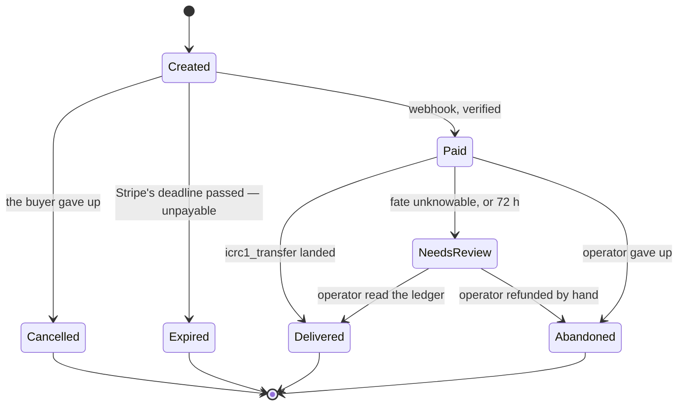

# Design decisions — the `§N` record

**The decision record for the cycles gateway.** Code comments say what the code *does*;
this says *why it is that way*. When those disagree, the code is right and this file is a
bug — fix it in the same change.

⚠️ **This file is load-bearing and enforced.** `scripts/check-design-sections.py` runs in
the verification gate and fails if a `§N` cited in the backend or the tests has no section
here, or if a section here is cited by nothing. It cannot check whether a section is
*true* — that is the obligation below.

> ## The obligation, for agents and humans
>
> **Change the behaviour, change this file in the same commit.** Not afterwards.
>
> Its predecessor was a 697-line spec that accumulated **67** mentions of architecture
> three issues had deleted, while `Main.mo` still cited it by section number. It was not
> abandoned — it was updated less often than the code. The rule that would have saved it
> is the one above.
>
> ⚠️ **Keep it lean, and delete rather than annotate.** A section describing something
> that no longer exists must be *removed*, not marked historical. History belongs in
> commit messages and GitHub issues, which are dated and attributable. Every paragraph
> here must be a decision someone could otherwise get wrong.

---

## §1 — Scope and sequencing

One rail: **Card, via Stripe**. Cycles are sold at cost from a pre-funded cycles reserve.
The build is done; what is left before real money is `docs/OPERATE.md`'s Mode 3.

## §2 — Identity and ownership

**Internet Identity for every purchase.** It costs no anonymity: II is pseudonymous and
issues a **per-origin principal** unlinkable to the same user elsewhere. Destinations are
arbitrary — you may fund any canister — so sign-in governs *ownership and history*, not
what you may buy. It exists to fix the lost-receipt problem.

⚠️ **The DERIVATION origin is irreversible after the first real purchase; the serving
domain is not.** II derives the principal *from* an origin, so changing that origin gives
every returning buyer a different principal: they cannot see their old orders, and the
cycles behind them are unreachable. Which is why the derivation origin is pinned to the
**frontend canister id** (`config.ts`) rather than to a domain — the canister id is the one
identifier a domain change cannot alter, so the domain stays a reversible decision.

Authz is `caller == order.owner`. **Order ids are random (`raw_rand`), not a counter** —
the id travels in the public `client_reference_id`, so randomness avoids enumeration and
avoids leaking order volume. It is **not** a bearer secret; there are no secret order
handles.

## §3 — Economics

**At cost, net of fees.** The rate applies to the **net** amount received (gross minus the
Stripe fee, from a configurable formula), so there is no structural per-order loss. The
operator absorbs the variance on international and FX cards, because reading Stripe's
actual fee needs a key scope we refuse to hold (§7).

⚠️ **What is locked at creation is the cycle QUANTITY, and it is immutable afterwards.**
The reserve tally is `Σ lockedCycles` over non-terminal orders, so anything that rewrote
that field would break the tally silently. This is what makes "no quote drift" literally
rather than approximately true.

⚠️ **Cycles are priced in XDR, not ICP.** Per-order ICP exposure cancels; the operator's
ICP risk sits in topping up the reserve, not in any individual sale.

### §3.1 — Rates

```
cycles = netCents × xdrPermyriadPerIcp × 10¹² / usdPerIcpMicros
```

⚠️ **ICP is an intermediate unit, not a position.** The gateway never holds, buys or
spends ICP — it hands over cycles it already owns. ICP appears in the arithmetic only
because both on-chain rate sources are denominated in it, and it **cancels**:
`(USD/ICP) ÷ (XDR/ICP)` is USD/XDR. Do not read the formula as a purchase of ICP.

⚠️ **Why derive rather than price off a market USD/XDR rate.** A cycle is *defined* in XDR
by the protocol, so the only question is where USD/XDR comes from. There is no on-chain
USD/XDR oracle, and the two rates used here are both on-chain, independently governed and
time-aligned (read on the same tick, so no timestamp reconciliation is needed). A market
USD/XDR rate would break even only when it happened to equal the protocol-implied one; any
gap becomes a **systematic bias on every order**, priced against a number the protocol does
not use.

The operator's remaining exposure is **inventory**, not per-order: cycles are sold at
today's implied USD/XDR and were funded into the reserve at whatever held when they were
bought. When to refill is the operator's decision.

Both inputs come from on-chain sources: **XRC** for USD/ICP and the **CMC** for
XDR/cycles. A refresh that fails leaves the previous rates standing, and orders stop being
quotable once the cache passes its staleness window — **refusing to sell is the safe
direction**; selling at a stale rate is not.

## §4 — One order, one state machine



⚠️ **Illegal transitions are ABSENT from the matrix, not guarded at runtime.**
`Expired → Paid` and `Cancelled → Paid` do not exist, and that absence *is* the guarantee
that a late payment cannot be honoured. A runtime check is something someone has to
remember; a missing edge is not.

⚠️ **Stripe owns the deadline.** The session expires, its webhook tells us, and `Expired`
is terminal. An earlier design made expiry advisory — a late genuine payment was honoured
— and that stopped being affordable once a `Created` order held reserve capacity.

### §4.1 — Money positions needing a human

Two structures, because they answer different questions:

- **Problems live on the order** (`Order.problems`). A problem earns its place only if it
  holds information that exists nowhere else **and** an action nobody has taken yet.
- **Orphans** are payments that cannot be attributed to any order — there is nothing to
  attach them to, so they keep a narrow list of their own.

Nothing drops from either.

**`NeedsReview` — every route to it, because a census beats a claim.** The status means
*"we can no longer ask safely"*, and it is reachable with the money position both unknown
and known:

*Unknown position* — a human must establish what happened:

1. **A stale transfer intent**: the intent is past the ledger's ~24 h dedup window, so a
   replay is no longer protected against double-paying. Reaching it takes a day-long
   ledger outage with an hourly sweep hammering it throughout — **expected never**, and
   documented as such rather than as a routine branch.
2. **The ledger's own escalating answers.** ⚠️ Not a second cause: a too-old rejection *is*
   case 1 told to us by the ledger instead of derived from our clock. Same position,
   different messenger.

*Known position* — nothing to establish, and this is the correction to a tidier claim of
"one trigger":

3. **The max-wait bound (§5.3)** fires on an order paid too long ago *whatever* the
   reason, including one where **nothing was ever sent** — position certain, instruction
   "refund in the Stripe Dashboard". So read any "one trigger" claim as scoped to the
   *unknown-position* routes.

*Unreachable guard*:

4. **The intent's amount exceeding the order's locked quantity**, which cannot happen
   because the amount was derived by subtracting a fee from that very quantity. ⚠️ If it
   ever fires it is not a counter-example to the census — it means `lockedCycles` acquired
   a second writer (§3), which is a much larger problem than one escalated order.

⚠️ **An escalation records the CAUSE and the MONEY POSITION separately, because they can
legitimately disagree.** The cause is why we stopped trying; the position is what a
transfer did or did not do. A stale intent stops the driver for one reason while the
position depends on whether a block was recorded — and *"establish its fate, never
rebuild"* is the right action regardless of why we stopped. The runbook's triage is
organised by position, because that is what determines the action; the cause is what
identifies the incident.

### §4.2 — Data model

One `persistent actor`. Orders are never deleted, which is what makes every index over
them a projection that can be rebuilt rather than a second source of truth.

### §4.3 — Cancellation is attributed, not raced

`Cancelled` and `Expired` are both terminal and unpayable, so they differ in exactly one
thing: **who decided**. The buyer needs that difference — being told their order expired
when they cancelled it is the defect `expiredBy` exists to prevent — and it is where that is
recorded.

⚠️ **The write is racy by construction and that is not a bug to remove.** Cancelling
expires the session at Stripe first, so Stripe fires `checkout.session.expired`
immediately, and three writers can reach the order before the cancel is recorded: that
webhook, the recovery sweep (§5.2), and the admin expire.

⚠️ **So the buyer's INTENT is recorded before the outcall, and whoever wins reads it.**
Not a lock. A lock needs every writer to remember a guard, and the first attempt at this
proved the point twice: a transient set the webhook's module could not see, then an
attribution the sweep and the admin expire used while the webhook — the writer that
actually wins — went on without it. `Orders.settleUnpayable` owns the
`Cancelled`-versus-`Expired` decision, so the race stops mattering instead of being
prevented.

Two consequences worth stating, because both look like oversights:

- The intent is **stable** and deliberately not cleared in a `finally`. A trap or an
  upgrade mid-cancel is precisely the window in which another writer settles the order,
  which is when the intent has to survive.
- It is **not** pruned "when the order goes terminal". Membership implies `Created`, and
  it is removed at each of that status's three exits — the enumeration is in
  `Main.cancelRequests`, and it is what bounds the set.

## §5 — Money-out

**One transfer from the cycles reserve**, and one transition (`Paid → Delivered`) that
performs it. One edge means one place a double-spend could live.

⚠️ **`icrc1_transfer` is the only declared way out**, enforced by a gate step that greps
the whole backend for a second one. The reserve floor is a *lower bound* only while that
holds: any other outflow makes the balance fall in a way the floor cannot see, and the
gate would then admit sales against cycles that already left.

### §5.1 — Ambiguous transfers

The corner that makes a delivery retryable with no risk of paying twice:

1. Persist the deterministic transfer arguments (`created_at_time`, amount, target, memo)
   **before** transferring.
2. Execute; on success persist the `block_index`.
3. On recovery, **replay the identical transfer.** The ledger either performs it once or
   answers `Duplicate { block_index }` — either way the block index is recovered.

⚠️ **Bounded by the ledger's ~24 h dedup window**, so the recovery cadence must stay well
inside it (enforced: cadence ≤ window ÷ 4). An intent older than the window with no known
block index must **not** be auto-replayed — it escalates to `NeedsReview`, whose whole
meaning is "the money position is unknown; a human must read the ledger".

### §5.4 — The reserve floor: why the gate needs no ledger call

The admission gate decides against a **maintained lower bound** on the reserve balance,
synchronously, with no ledger read. That is sound because of one asymmetry in who can move
the balance:

- it can only **decrease** when we transfer out, and every such outflow decrements this
  floor by `amount + fee` **before** issuing its transfer. ⚠️ **There are TWO destination
  classes, and "one outflow" is about the mechanism, not the recipient** — `icrc1_transfer`
  is the only way out, but it serves both:
  - **delivery**, to a buyer's own account, bounded by that order's promise, which the gate
    already admitted against this floor;
  - **withdrawal**, to a controller, guarded on there being **no promise-holder at
    all** — so nothing can be owed to a buyer when it runs — and refused again after its
    own balance read, because the floor is still full across that await.

  The asymmetry holds for either class for the same reason: the decrement precedes the
  transfer, so the floor is never optimistic about a transfer in flight.
- it can only **increase** when someone tops the account up, which we cannot see without
  asking — and which is always positive.

So every unobserved change is in our favour, and a floor maintained from our own outflows
is never optimistic. Deciding against it can refuse a sale the reserve could have covered;
it can never admit one it cannot.

⚠️ **This replaced an awaited balance read on the order-creation path**, which is where a
whole class of bug lived: the awaited value was correct when computed and historical when
used, and pairing it with a live tally made the available figure optimistic by a full
order. The decision still reads **two** numbers — the floor and the promise tally — but
both are now *maintained*, so what is gone is the awaited-versus-live pairing, not the
second operand.

**Three rules keep it a bound:**

1. **A fresh observation is adopted only in a quiet window, and a shortfall is shouted
   about.** "Quiet" means nothing was in flight before the read, nothing after it, and
   nothing was issued in between — see below for why that condition is the whole safety
   property. The ledger holding *less* than the floor means an outflow we did not cause,
   which the asymmetry says is impossible.
2. **A transfer decrements the floor when it is ISSUED, not when it settles, by
   `amount + the fee for this attempt`.** The only way the balance can surprise us
   downward is one of our own transfers landing without our learning it did — our reply
   callback traps, so the debit stands while our bookkeeping rolls back. Assuming the
   debit at issue time makes that case exact instead of optimistic.

   ⚠️ **The fee is in the FLOOR decrement but not in the promise tally**, and the
   asymmetry is deliberate: the ledger charges its fee on top of the amount, so an
   outflow moves the balance by `amount + fee` while what an order *promises* is the
   amount alone (§3). Adding a fee term to the tally double-counts.
3. **A definitively-failed transfer credits the floor back**, `#Duplicate` included — that
   answer says *this* call moved nothing, so its decrement was never a real debit even
   though an earlier attempt's was. A `#BadFee` re-issue therefore credits back
   `amount + fee` and decrements `amount + the corrected fee`; if the re-issue then fails
   with no reply, the **larger** decrement stands, which is correctly pessimistic.

   ⚠️ **A call that failed with no reply is NOT credited back.** It says nothing about
   whether the ledger acted, and rule 2 exists for exactly that case.

⚠️ **Adoption is conditional, and the condition is the whole safety property.** Adopting a
read that was taken before an outflow erases that outflow's decrement while the transfer
still debits. So a balance is adopted only when nothing was in flight before the read,
nothing after it, and nothing was issued in between. Skipping is cheap — the sweep tries
again; a top-up waits but is never lost.

**The quiet-window predicate is a conservative superset of "in flight".** It counts any
journalled intent with no recorded block on an order still `Paid` — which includes a
delivery *parked between retries*, when nothing is in the air at all. That is deliberate:
a transfer issued before a balance read can land after it, and the journal cannot
distinguish "awaiting a reply" from "failed, waiting for the next sweep". Tracking true
in-flight state would need a counter incremented before the await, which leaks upward
permanently if a reply callback traps — trading bounded pessimism for unbounded.

**It is evaluated over the promise index, never over the journal.** The journal gains an
entry per paid order and loses none, so a walk over it costs whatever the gateway has ever
sold; the orders holding a promise are bounded by flow — at most `floor / smallest
order` can hold one at a time, whatever the gateway's history. Reading the index is
*complete*, not merely cheaper: a transfer is only ever issued from `Paid`, `Paid` holds
the promise, and the index is maintained on that same promise predicate at the one site
that writes a status. The three exits from `Paid` preserve it — `Delivered` records the
block in the same patch, `NeedsReview` is still non-terminal and still indexed, and
abandonment is **refused while a transfer is open**. That refusal therefore holds up the
quiet window as well as the double-payout it was added to prevent.

⚠️ The direction of error matters here and it is not the usual one: this count coming out
**low** means the window reads quiet while a transfer is in flight, which is the
*oversell* direction. Completeness is the property to protect, which is why it is argued
from construction above rather than repaired by a recount. A **stale** index member is
harmless by contrast — its order no longer reads `Paid`, so it does not count.

**The status comes from the order, not from the journal's copy of it.** The two are
allowed to disagree, and a predicate that mixes them is a predicate with two sources of
truth; the journal entry supplies only the transfer intent and the block index.

⚠️ **Escalated orders must be excluded from it, or one escalation freezes the reserve for
the life of the canister.** An escalated order keeps the intent-without-block shape
*forever*, so without the `Paid` clause every reconcile skips, every manual refresh skips,
and top-ups silently stop registering — the rail slowly closing with no lever. Excluding
them is sound because they have no outstanding callback: escalation is decided either
before a call is made or after its response arrived, never with one in flight. Their
pessimism is not lost — the promise tally still holds them.

**The cost, and why it is not a deadlock.** While a delivery is retrying, a top-up is not
adopted, so *new sales* are refused against cycles the ledger already holds. Deliveries
never consult the floor, so delivery itself is unaffected: a dry reserve fails with
insufficient funds, the operator tops up, the retry succeeds *because the ledger has the
cycles regardless of our floor*, and the next reconcile adopts. The remaining pessimistic
case is a ledger outage, where refusing to sell is the correct posture anyway.

⚠️ **The floor and the promise tally overlap while a transfer is in flight, deliberately.**
The floor drops at issue; the promise is released one response later at `Delivered`. In
between the same order is subtracted twice, so the available figure reads a full order low
for the length of one ledger call. **Do not close the gap by moving either end**: releasing
the promise at issue frees capacity for a sale while the transfer consuming it is
unresolved, and decrementing the floor at settle time lets the balance surprise us
downward. Both ends sit on the pessimistic side of the same unknown.

### §5.2 — Recovery

A recurring timer sweeps orders with money-out work outstanding, single-flight, re-armed
after upgrade. Bookkeeping checks run **detached in their own message**: a check must
never be able to stop orders from delivering.

### §5.3 — Delivery time bounds

Two: an **alert** threshold (the delivery is late; a human should look) and a **max-wait**
bound (the position is now unresolvable automatically, so it escalates). Both are operator
configurable.

## §6 — Rails

### §6.0 — Ingress

Two paths, and the webhook **cannot** be caller-authenticated: Stripe is the caller, and
it authenticates by signing the payload. So exactly one anonymous, payload-authed HTTP
route exists, and it verifies an HMAC before trusting anything in the body.

### §6.1 — Card

Inbound-only in the sense that matters: the canister holds a **restricted** key scoped to
Checkout Sessions, never an `sk_`. It can create sessions and read them back; it cannot
refund, read customers, or reach the account.

## §7 — Security and trust

⚠️ **Both secrets are plaintext canister state, and that is at-rest only — provisioning
is sealed (§7.3).** HMAC is symmetric, so *verify = forge*: anything that can check a
signature can forge one, and encrypting the stored blob would only move the problem to the
key that decrypts it. The plaintext therefore has to exist in memory at verification time,
which is why at-rest confidentiality is a subnet property rather than something this
canister can solve.

⚠️ **The two exposures are separate and were routinely conflated.** *In transit* — a
secret arriving as an ingress argument, seen by the TLS-terminating boundary node and
anything reading a shell history or CI log — is closed, by vetKD sealing. *At rest* — the
value living in replicated, checkpointed canister memory — is not closed **by sealing**,
and cannot be; it is closed by the confidential subnet instead, whose checkpoint and
state-sync paths are confirmed confidential. Sealing
works through why the obvious fix (store ciphertext, derive per use) fails on both
economics and mechanism: at ~26 B cycles per derivation it would cost roughly 3.5 cents
per webhook on an at-cost rail, and a checkpoint captures the heap, so a cached derived
key sits in the same checkpoint as the ciphertext it opens.

⚠️ **The blast radius is the reserve balance, and sizing it is the control.** A forged
"paid" webhook delivers from the reserve. An earlier design bounded this with a per-period
ICP burn cap; there is no cap now, so the trade is "size the reserve to what a leak could
cost", not "the cap bounds it". SEV-SNP is the intended confidentiality layer and launch
does not block on it — `RUNBOOK.md` §9 is the verification checklist, hardest item first.

⚠️ **A leaked API key can only create sessions that pay us.** That asymmetry is why the
key's *scope* matters more than its storage. A restricted key scoped to Checkout Sessions
= Write can create sessions and read them back (which the recovery sweep needs); an
unrestricted key able to issue refunds would be materially worse to leak.

⚠️ **The reserve is a STOCK, not a rate, and that is a better bound than a per-period cap
in two ways** — worth stating because "no rate limit" reads as weaker. A cap resets, so a
patient attacker drains it again every period and the operator's total loss is unbounded
over time; the reserve, once empty, refuses further deliveries and cannot be drained again
until a human funds it. And the drain is *visible* in a value the gateway already reports:
the floor only moves down when this gateway issues a transfer, so cycles leaving faster
than orders arrive is exactly the discrepancy `reserve_status` exposes.

⚠️ **And the one way a stock is worse, stated because an argument that lists only its own
advantages is advocacy.** A cap spreads a loss across periods and so bounds how *fast* it
can happen; a stock can go in a single burst between the leak and its rotation. The design
accepts that and controls it by **sizing** — keep in the account what you are willing to
lose in one go — and by refunding the reserve only after the secret is dead. Both are
procedure rather than mechanism, which is exactly why they are written down (`docs/OPERATE.md`,
§2).

**Rotation needs no dual-secret window on our side.** While a rolled Stripe secret's
predecessor is still live, Stripe sends one signature per active secret and verification
accepts any single match, so swapping the stored blob at any point during the overlap
never drops a delivery.

**Governance is a flat controller allowlist with equal privileges.** Any controller can
upgrade, rotate either secret, resolve obligations, set tiers and adjust pricing. The
honest trust model is "trust the operator set; any one of them can upgrade and then
drain". There is deliberately **no** method that moves money (§5). True M-of-N needs a
multisig *canister* as controller, since IC controllers are OR-semantics.

### §3.2 — Who owns which number

⚠️ **The canister reports what only it knows; the ledger owns what it owns.** The reserve
balance is a free query on the cycles ledger that anyone can call, so this canister never
mirrors it — what it adds is the part nobody else can compute, how much of that balance is
already promised. The same split decides what a quote discloses: the cycles-ledger transfer
fee is the ledger's number and the *operator's* cost, so it is absorbed rather than shown
as a line in the buyer's price, and the frontend reads it from the ledger directly.

⚠️ **A stored copy of someone else's number is only acceptable where a wrong value is
self-correcting and cheap.** The delivery path stores the ledger's fee because a wrong one
costs exactly one rejected transfer and the rejection carries the correct value. A quote
has no such correction — nothing checks the number a buyer was shown — so a stored fee
there would buy only the staleness.

### §7.1 — A refused operator lever answers with a tag, not a sentence

`expire_order`, `abandon_order` and `record_delivered` return a variant `Err`
(`Orders.ExpireError` / `AbandonError` / `RecordDeliveredError`), so a caller can tell
one refusal from another without matching on prose — `reviewing-motoko` T4, and the
shape `create_order` already used on the money-in path.

⚠️ **The sentences those methods used to return are gone from the wire, deliberately,
and this table is where they went.** moc emits no docs for variant arms, so the `.did`
carries bare tags, and the audit log is not an alternative home for two reasons that are
not the admissibility rule: an audit line is a record for the operator **later**, not a
response to the caller **now**, so it cannot be a refusal's message; and `AuditLog.mo`'s
own caveat — a bound on the *rate* is not a bound *over time* against an unfixed
condition — makes one line per refused admin attempt the wrong shape for a log that
never prunes. ⚠️ **These refusals are not inadmissible.** `expire_order` already audits
two of its own (`order.expireRaced`, `order.expireFailed`): both are admin-gated and
follow a real outcall, and what the rule excludes is a *pre-commit refusal line fed by a
free caller*, which is a different thing. So the guidance lives here and in the arm docs
in `Orders.mo`, and a console can render per-case copy off the tag.

⚠️ **What an operator loses is advisory only: the refusal IS the guard.** Misreading
`#deliveryOutstanding` cannot cause the double payout, because the lever has already
refused. That is what makes the trade acceptable while there is no console.

| Tag | What it means | What to do |
|---|---|---|
| `#notFound` | No such order id | Check the id |
| `#notCreated` (expire) | Only a `#created` order can be expired; carries the status seen | A paid order delivers or escalates; `abandon_order` is for a paid one you have refunded |
| `#sessionNotOpen` | Stripe says the session is settled or already expired | Nothing changed. Wait — the webhook or the sweep resolves it on Stripe's answer, the only authority on which of the two happened |
| `#stripeUnauthorized` | 401/403 | Rotate the key: the restricted key needs **Write** on Checkout Sessions. The latch has already notified |
| `#stripeFailed` | Carries Stripe's own wording as `detail` | Read the detail; it is not paraphrased |
| `#movedInFlight` (expire) | A second tab settled the order during the outcall | Nothing changed. Re-read the order |
| `#notAbandonable` | Only a paid or under-review order can be abandoned | Carries the status seen |
| `#deliveryOutstanding` | ⚠️ The transfer is outstanding, so whether the cycles moved is **unknown** | **A wait, not a refusal.** Check `pending_deliveries`. Either it settles and needs no refund, or the ~24 h dedup window escalates it to `#needsReview`, where the ledger is the source of truth and the order id is in the transfer's memo |
| `#reasonRequired` | `abandon_order` was called with an empty reason | The audit trail must record *why* alongside *who* |
| `#notUnderReview` | Only an under-review order can be recorded as delivered | A live order delivers on its own |
| `#transitionRefused` | The state machine refused the transition | Re-read the order; something moved it |

`cancel_order`'s errors are typed too — §7.2 is the rule that let its copy move to the frontend, and what that rule refuses.

### §7.2 — Facts stay in the canister; copy may leave it

⚠️ **The rule, and it is what decides each case rather than a preference for one layer:**
a refusal's copy may live in the frontend **provided its payload carries every fact the
sentence asserted.** Where the copy *is* the facts, it stays on-chain.

`cancel_order` satisfies it: `#notCancellable` and `#settledInFlight` carry the
status their sentences name, `#sessionNotClosed` is deliberately one tag for three
indistinguishable causes (§4.3) — which is exactly what its sentence said — and
nothing else in the seven asserted a fact beyond "this happened".

⚠️ **What is given up, stated because it is real.** With prose from the canister, the
sentence a buyer reads is composed on-chain. With tags, whoever deploys the frontend
controls the explanation. That is acceptable here and only here because the FACTS remain
independently checkable: `get_order` and `receipt` carry the status and the figures, so a
buyer misled by page copy can verify the actual state without trusting the page. Apply
this rule to `receipt` and the answer flips — there the copy is the facts, and it stays.

`scripts/check-typed-errors.py` enforces the typed half; the payload half is a review
question, because no check can tell whether a variant carries what its sentence claims.

### §7.3 — Sealed provisioning, and an unaudited dependency on the money path

Both secrets are provisioned as **ciphertext**: the operator derives this canister's vetKD
public key offline and encrypts to it, and only this canister can obtain the matching
private key. `set_stripe_api_key` and `set_webhook_secret` take a `blob`, decrypt at set
time, and store the plaintext. The full mechanism — why offline derivation, why one
identity for both secrets, why the key is cached transiently — is in `src/backend/Sealed.mo`.

⚠️ **Decryption happens at SET time, which is what makes a wrong seal a provisioning error
rather than an outage.** A ciphertext sealed to the wrong key fails in front of whoever is
seeding it, with the store untouched, instead of being accepted and found unreadable at the
first webhook. `Secret.set`'s length floor then applies to the decrypted value, not to the
envelope.

⚠️ **The decrypting code is EXPERIMENTAL and UNAUDITED, and the reason that is acceptable
here is an asymmetry — not a judgement that the code is fine.** `mo:ic-vetkeys` has no
BLS12-381, so `vendor/icp-seeding-secrets-poc` (a git submodule, pinned by commit) supplies
the curve as `ic-bls12-381` and the vetKD layer on it. ICDevs' `bls12-381` on mops is a
separate implementation of the same curve that nobody has run against `ic_bls12_381`'s
vectors, so it is not a drop-in replacement. The division of labour is what matters:

| step | performed by | audited |
|---|---|---|
| derive the public key | `@icp-sdk/vetkeys` (client) | its curve, `@noble/curves`, is |
| **encrypt the secret** | `@icp-sdk/vetkeys` (client) | its curve, `@noble/curves`, is |
| decrypt in-canister | the pinned Motoko port | **no** |

`@icp-sdk/vetkeys` is DFINITY's own library and makes no audit claim of its own; the
BLS12-381 and hash-to-curve it builds on come from `@noble/curves`, which Cure53 audited in
2024 with both in scope. The secret's confidentiality *in transit* rests entirely on the
ciphertext, which that client code produced, and on the vetKD protocol. The unaudited half
only **opens** that ciphertext, after it has already crossed the boundary node safely — so
a bug there fails provisioning closed (an error, nothing stored) rather than weakening
anything in flight. Set against the alternative it replaced, a live `rk_...` in an ingress
argument, this cannot be worse.

⚠️ **Three limits of that argument, stated because an asymmetry is easy to over-claim.**
First, `VetKey.decryptAndVerify`'s verification step *is* security-relevant: if it were
vacuous, a forged vetKD reply would be accepted — though only the subnet serving the key
could forge one, and it can read canister memory regardless, so it is not new exposure.
Second, the argument is architectural; nobody here has reviewed the field arithmetic. What
stands in for that is `scripts/check-crypto-vectors.sh`, which runs the port's 108 vectors
— generated from `ic_bls12_381` and `ic-vetkeys`, DFINITY's Rust implementations, which are
themselves unaudited — in this project's gate under this project's toolchain. That is not an
audit and does not pretend to be. Third, the port's point decompression does not check
membership of the prime-order subgroup, which `ic_bls12_381` does. Every point it
decompresses here comes from a controller (the ciphertext — both provisioning endpoints are
`requireController`) or from the subnet (the vetKD reply and public key), and both can
already read canister memory, so the gap admits no one new.

⚠️ **The acceptance is DECIDED, and it is conditional on a check — not on the argument
above.** Unaudited crypto on this path was accepted for this repository by its owner. What
makes that safe to have decided is not the asymmetry, which is reasoning, but
`scripts/check-crypto-vectors.sh`: 108 vectors from the Rust reference, run in this
project's gate under **this project's** toolchain pins. Upstream pins its own `moc` and ours
moves independently, so that combination is tested nowhere else.

**So the check is load-bearing for the decision, and the failure mode is silent.** If it is
ever deleted, or starts skipping, or stops collecting vectors, the acceptance rests on
prose alone and nothing says so. The count floor and the abort-on-missing-submodule guard
in that script exist for exactly that reason — a vacuous pass there is worse than a red
gate. ⚠️ A **`moc` upgrade is the change most likely to surface this** (see the
endpoint-doc inversion below): if a bump makes the vendored packages fail to compile, the
tempting fix is to skip their suites and move on, which quietly removes the only thing
standing behind this section.

**Deletion criterion:** when `mo:ic-vetkeys` ships BLS12-381 — or a published curve is shown
to agree with `ic_bls12_381` on the port's vectors — the submodule and both path
dependencies go, and this section becomes a note about what used to be here.

## §8 — Verifiability

The thesis: **the number an operator monitors is the number a buyer can check.** The
reserve is an account on the cycles ledger, so anyone can read its balance without this
canister's cooperation. What the canister adds is the part only it knows — how much of
that balance is already promised.

## §9 — Layout and the test bar

One Motoko backend canister plus a static asset canister, a hand-rolled `Http.mo` rather
than a framework, and Candid bindings for the ledgers this canister actually calls.
Modules take their dependencies as records, which is why the whole ingestion path is
unit-testable with no IC environment.

Inside the backend: `Main.mo` owns state and composes, the public endpoints live in
`mixins/` split by feature, and the domain logic is flat stateless modules — `Orders`,
`Delivery`, `Gate`, `Reserve`, `Pricing`, `Receipts`, `rails/Card`. §9.1 has the rules
the mixin layer rests on.

⚠️ **The go-live bar is PocketIC, not the unit suites.** Unit tests wherever logic is
isolable — HMAC, fee and rate arithmetic, parsers, state-machine transitions, dedup — and
a PocketIC scenario for everything that needs a replica: upgrades mid-delivery, ledger
outages, real HTTP ingress, the §5.1 replay contract. A change is not done on a build or a
unit pass alone. `test/integration/README.md` maps the scenarios to the items here.

### §9.1 — Endpoints live in mixins, and how state reaches them

`main.mo` owns state and composes; the public endpoints live in `mixins/`, split by
feature. That is the `writing-motoko` architecture, and a public method in the
composition root is `reviewing-motoko` A1.

⚠️ **`include` evaluates its arguments ONCE and passes them by value.** That single fact
decides the shape of every mixin here:

- **A record or collection passes directly.** `Set`, `Map`, `Orders.Store`,
  `Secret.Store` and the seven `*State` records are heap objects, so the mixin and the actor
  share one and writes go through.
- **A bare `var` must NOT be passed.** The mixin would receive a snapshot from install
  time: its writes would land on a copy and its reads would never move. This is silent —
  it compiles, and the getter simply answers the initial value forever.

⚠️ **So mutable state is grouped into SEVEN subsystem records rather than passed field
by field.** `reserveState`, `gateState`, `pricingState`, `stripeState`, `tierState`,
`deliveryState`, `recoveryState`. Grouping is also what A6 asks for: a mixin receives the
slice it uses. The alternative — an accessor closure per field — needs no shape change,
and it is what the three TRANSIENT fields still use, for a sharper reason: they exist to
answer "has this happened since the canister started", which a value frozen at include
time answers wrongly and confidently. For the 21 grouped `var` fields it would have put
plumbing at every include site to work around by-value semantics.

⚠️ **Two counts in this section have different denominators, so each is stated with its
instrument.** The seven records hold **21 `var` fields** between them — that is the
number every claim in this section is about. `deployed/backend.most` separately declares
**19 top-level stable names**, of which seven are those records. The two figures move
independently, so a bare number here is how an edit lands on the quantity nobody
measured.

⚠️ **`webhookPaidOrder` uses a TAKE-ONCE accessor**, not a get/set pair: the dispatcher
sets it and the mixin consumes it in the same message, so reading and clearing as one
operation is what stops a stale value from triggering a second delivery kick — on the one
route that is unauthenticated by necessity.

⚠️ **An immutable transient value passes directly.** `routes`, `maxRequestBodyBytes` and
the `cyclesLedger` actor reference are transient `let`s built during initialisation, which
is when `include` evaluates its arguments, and none of them ever changes. The rule above
is about MUTABLE state; a snapshot of an immutable value is the value.

⚠️⚠️ **Grouping also closed those fields to future extension, and THAT cost outlives the
one-time drop below.** Before the split each of those 21 was an actor-level `var`, and
adding another was free. Now a new field inside any `*State` record needs the migration
chain this project has never had (§11) — measured both ways on the branch that
introduced them:

| Change | `mops check` |
|---|---|
| a field added to `reserveState` | ✗ *"expected field … is missing … Write an explicit migration function"* |
| a new **actor-level** stable `var` | ✓ *"Stable compatibility check passed"* |

⚠️ **So the cheap route still exists and this rule must not hide it:** new mutable state
that a mixin needs can be **a new actor-level stable `var` plus an accessor pair at the
include site** — which is exactly what `stripeState.origin`'s predecessor did, and what
the transient fields still do. Grouping is the default because it reads better and
enforces A6; it is not the only option, and reaching for it by reflex is how a routine
field addition turns into a migration.

⚠️ **Grouping moved the stable shape, and that was a deliberate call, taken once.**
Twenty-one stable variables were dropped rather than migrated, across two grouping passes — one per `var` field, all seven records. Legitimate only because
there is no deployment whose data matters: pre-launch, with no migration chain (§11 /
§11), reinstall is the documented loop. `scripts/check-stable-promotion.sh` refuses such
a promotion unless `--accept-reinstall` is passed, and prints which variables are lost —
so the decision is stated rather than absorbed. **After the first deployment worth
keeping, this is no longer available** and a change of this shape needs the chain.

⚠️ **Two costs of mixins, both measured rather than assumed:**

1. **~~`moc` does not emit doc comments for mixin members~~ — FIXED in moc 1.16.0, and
   this entry is kept to record that it reversed.** On 1.15.1 a relocated endpoint lost its
   documentation from `backend.did` and from the generated TypeScript bindings, ~6 lines
   per endpoint. 1.16.0 emits them: measured on this project as 0 → **613** doc lines
   inside the service block, all 62 endpoints' published blocks byte-equal to their source
   blocks.

   This entry said the cost "reverses on its own if moc changes", and it did — but not
   neutrally. `scripts/check-endpoint-docs.py` had grown a second check that asserted the
   `.did` documented *no* endpoint, sound only while the docs were being dropped, whose
   remedy (*make it `//`*) would now delete a deliberately published doc. It was replaced
   by a direct comparison of published against written. ⚠️ **The lesson worth keeping: a
   compiler defect that a check is built on is a dependency, and the fix is a breaking
   change to the check.**
2. **Only imports may precede a `mixin` block** (M0228), so a type the mixin's interface
   needs cannot be declared above the block in the same file — it goes inside the block,
   or in a module.

   ⚠️ **What actually matters is the NAME, not the location, and an earlier version of
   this rule said "never moved to `Types.mo`" — absolute beyond its own reasoning.**
   Candid derives a type's published name from its declaration, so a move that keeps the
   name keeps the interface: `Amount` lives in `Types.mo` so `Purchase.plan` can
   name it, and `type Amount` is byte-identical in `backend.did` before and after. A
   RENAME is what moves the interface. The acceptance test below is what tells the two
   apart, so relocate freely and let it decide.

⚠️ **The acceptance test for a relocation is `scripts/check-did-signatures.sh`**: the
Candid signatures must be identical with doc comments stripped. It has already caught
what review would not — **Candid records argument names**, so a mixin parameter that
forces an endpoint's parameter to be renamed moves the published signature.

⚠️ **Three more invariants belong to the same pass, because a textual rename breaks all
of them silently:** the audit tag literals (RUNBOOK §8 alerts on exact text, and one
rename hit 34 of them), that every endpoint still carries a doc, and that each guarded
method still calls the guard its tier declares. `check-endpoint-docs.py`,
`check-admin-tiers.py` and a tag diff cover those; run them per group, not once at the
end.

## §11 — Deferred

A second rail, M-of-N or SNS governance, an external audit of the delivery and
secret-handling paths, and archival once volume warrants. Events this gateway does not
subscribe to (disputes, for instance) are acked rather than refused, so a Dashboard
configuration cannot disable the endpoint.

### §11.1 — Seams that are binding

A second rail should *add* rather than force an unwind. Four seams are deliberate, and
each is stated at the code it constrains:

1. **`Owner` stays a one-case variant** (`{ #ii : Principal }`). Adding a case to a stable
   variant is migration-free; widening a bare `Principal` is a stable-state migration plus
   an audit of every authz site. The variant also makes the compiler force every authz
   check to pattern-match.
2. **HTTP dispatch goes through a route *table*.** "Exactly one route" is policy, not
   architecture.
3. **Ownership is captured at the API edge.** `Orders.create` takes the owner as a
   parameter and never reads `msg.caller`.
4. **Expiry is per-rail money-in policy, not core behaviour.** The state machine owns
   transitions, not expiry policy — §4's reversal is why this seam matters.
