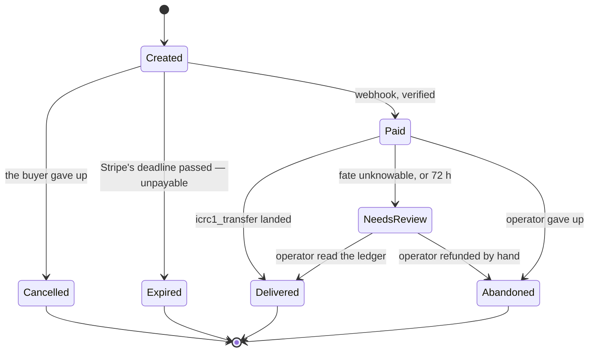

# Design decisions — the `§N` record

**The decision record for the cycles gateway.** Code comments say what the code *does*;
this says *why it is that way*. When those disagree, the code is right and this file is a
bug: fix it in the same change.

`scripts/check-design-sections.py` runs in the verification gate and fails if a `§N`
cited in the backend or the tests has no section here, or if a section here is cited by
nothing. It cannot check whether a section is *true*, so: **change the behaviour, change
this file in the same commit.** Keep it lean and delete rather than annotate; a section
describing something that no longer exists is removed, not marked historical.

---

## §1 — Scope and sequencing

One rail: **Card, via Stripe**. Cycles are sold at cost from a pre-funded cycles reserve.
The build is done; what is left before real money is `docs/OPERATE.md`'s Mode 3.

## §2 — Identity and ownership

**Internet Identity for every purchase.** It costs no anonymity: II is pseudonymous and
issues a per-origin principal unlinkable to the same user elsewhere. Destinations are
arbitrary, so sign-in governs ownership and history, not what you may buy. It exists to
fix the lost-receipt problem.

⚠️ **The derivation origin is irreversible after the first real purchase; the serving
domain is not.** II derives the principal from an origin, so changing that origin gives
every returning buyer a different principal and makes their cycles unreachable. The
derivation origin is therefore pinned to the **frontend canister id** (`config.ts`)
rather than to a domain, so the domain stays a reversible decision.

Authz is `caller == order.owner`. **Order ids are random (`raw_rand`), not a counter**:
the id travels in the public `client_reference_id`, so randomness avoids enumeration and
leaking order volume. It is not a bearer secret; there are no secret order handles.

## §3 — Economics

**At cost, net of fees.** The rate applies to the net amount received (gross minus the
Stripe fee, from a configurable formula), so there is no structural per-order loss. The
operator absorbs the variance on international and FX cards, because reading Stripe's
actual fee needs a key scope we refuse to hold (§7).

⚠️ **What is locked at creation is the cycle QUANTITY, and it is immutable afterwards.**
The reserve tally is `Σ lockedCycles` over non-terminal orders, so anything that rewrote
that field would break the tally silently.

⚠️ **Cycles are priced in XDR, not ICP.** Per-order ICP exposure cancels; the operator's
ICP risk sits in topping up the reserve, not in any individual sale.

### §3.1 — Rates

```
cycles = netCents × xdrPermyriadPerIcp × 10¹² / usdPerIcpMicros
```

⚠️ **ICP is an intermediate unit, not a position.** The gateway never holds, buys or
spends ICP. ICP appears in the arithmetic only because both on-chain rate sources are
denominated in it, and it cancels: `(USD/ICP) ÷ (XDR/ICP)` is USD/XDR.

**Why derive rather than price off a market USD/XDR rate.** A cycle is defined in XDR by
the protocol, and there is no on-chain USD/XDR oracle. The two rates used here are both
on-chain, independently governed and read on the same tick. A market USD/XDR rate would
be a systematic bias on every order, priced against a number the protocol does not use.
The operator's remaining exposure is inventory: cycles are sold at today's implied
USD/XDR and were funded into the reserve at whatever held when they were bought.

Both inputs come from on-chain sources: **XRC** for USD/ICP and the **CMC** for
XDR/cycles. A refresh that fails leaves the previous rates standing, and orders stop
being quotable once the cache passes its staleness window. Refusing to sell is the safe
direction.

### §3.2 — Who owns which number

⚠️ **The canister reports what only it knows; the ledger owns what it owns.** The reserve
balance is a free query on the cycles ledger, so this canister never mirrors it; what it
adds is how much of that balance is already promised. The same split decides what a
quote discloses: the cycles-ledger transfer fee is the ledger's number and the
operator's cost, so it is absorbed rather than shown in the buyer's price, and the
frontend reads it from the ledger directly.

**A stored copy of someone else's number is acceptable only where a wrong value is
self-correcting and cheap.** The delivery path stores the ledger's fee because a wrong
one costs exactly one rejected transfer and the rejection carries the correct value. A
quote has no such correction, so a stored fee there would buy only staleness.

## §4 — One order, one state machine



⚠️ **Illegal transitions are ABSENT from the matrix, not guarded at runtime.**
`Expired → Paid` and `Cancelled → Paid` do not exist, and that absence is the guarantee
that a late payment cannot be honoured. A runtime check is something someone has to
remember; a missing edge is not.

⚠️ **Stripe owns the deadline.** The session expires, its webhook tells us, and `Expired`
is terminal. Advisory expiry stopped being affordable once a `Created` order held
reserve capacity.

### §4.1 — Money positions needing a human

Two structures, because they answer different questions:

- **Problems live on the order** (`Order.problems`). A problem earns its place only if it
  holds information that exists nowhere else **and** an action nobody has taken yet.
- **Orphans** are payments that cannot be attributed to any order, so they keep a narrow
  list of their own.

Nothing drops from either.

**Every route to `NeedsReview`**, because the status means *"we can no longer ask
safely"* and is reachable with the money position both unknown and known:

1. *Unknown position*: **a stale transfer intent**, past the ledger's ~24 h dedup
   window, so a replay is no longer protected against double-paying. Reaching it takes a
   day-long ledger outage; expected never. The ledger's own `#TooOld` rejection is the
   same case told to us by the ledger.
2. *Known position*: **the max-wait bound (§5.3)** fires on an order paid too long ago
   whatever the reason, including one where nothing was ever sent. Position certain,
   instruction "refund in the Stripe Dashboard".
3. *Unreachable guard*: **the intent's amount exceeding the order's locked quantity**,
   which cannot happen because the amount was derived by subtracting a fee from it. If
   it ever fires, `lockedCycles` acquired a second writer (§3).

⚠️ **An escalation records the CAUSE and the MONEY POSITION separately, because they can
legitimately disagree.** The cause is why we stopped trying; the position is what a
transfer did or did not do. The runbook's triage is organised by position, because that
determines the action.

### §4.2 — Data model

One `persistent actor`. Orders are never deleted, which is what makes every index over
them a projection that can be rebuilt rather than a second source of truth.

### §4.3 — Cancellation is attributed, not raced

`Cancelled` and `Expired` are both terminal and unpayable, so they differ in exactly one
thing: who decided. The buyer needs that difference, and `expiredBy` is where it is
recorded.

⚠️ **The write is racy by construction and that is not a bug to remove.** Cancelling
expires the session at Stripe first, so Stripe fires `checkout.session.expired`
immediately, and three writers can reach the order before the cancel is recorded: that
webhook, the recovery sweep (§5.2), and the admin expire.

⚠️ **So the buyer's INTENT is recorded before the outcall, and whoever wins reads it.**
Not a lock: a lock needs every writer to remember a guard. `Orders.settleUnpayable` owns
the `Cancelled`-versus-`Expired` decision, so the race stops mattering instead of being
prevented. Two consequences that look like oversights:

- The intent is **stable** and deliberately not cleared in a `finally`. A trap or an
  upgrade mid-cancel is precisely the window in which another writer settles the order.
- It is not pruned "when the order goes terminal". Membership implies `Created`, and it
  is removed at each of that status's three exits, enumerated in `Main.cancelRequests`.

## §5 — Money-out

**One transfer from the cycles reserve**, and one transition (`Paid → Delivered`) that
performs it. One edge means one place a double-spend could live.

⚠️ **`icrc1_transfer` is the only declared way out**, enforced by a gate step that greps
the whole backend for a second one. The reserve floor is a lower bound only while that
holds: any other outflow makes the balance fall in a way the floor cannot see.

### §5.1 — Ambiguous transfers

The corner that makes a delivery retryable with no risk of paying twice:

1. Persist the deterministic transfer arguments (`created_at_time`, amount, target, memo)
   **before** transferring.
2. Execute; on success persist the `block_index`.
3. On recovery, **replay the identical transfer.** The ledger either performs it once or
   answers `Duplicate { block_index }`; either way the block index is recovered.

⚠️ **Bounded by the ledger's ~24 h dedup window**, so the recovery cadence must stay well
inside it (enforced: cadence ≤ window ÷ 4). An intent older than the window with no known
block index must **not** be auto-replayed; it escalates to `NeedsReview`.

### §5.2 — Recovery

A recurring timer sweeps orders with money-out work outstanding, single-flight, re-armed
after upgrade. Bookkeeping checks run detached in their own message: a check must never
be able to stop orders from delivering.

### §5.3 — Delivery time bounds

Two: an **alert** threshold (the delivery is late; a human should look) and a **max-wait**
bound (the position is now unresolvable automatically, so it escalates). Both are operator
configurable.

### §5.4 — The reserve floor: why the gate needs no ledger call

The admission gate decides against a **maintained lower bound** on the reserve balance,
synchronously, with no ledger read. That is sound because of one asymmetry:

- the balance can only **decrease** when we transfer out, and every such outflow
  decrements this floor by `amount + fee` **before** issuing its transfer. ⚠️ There are
  two destination classes for the one mechanism: **delivery** to a buyer's own account,
  bounded by that order's promise; and **withdrawal** to a controller, guarded on there
  being no promise-holder at all and refused again after its own balance read.
- it can only **increase** when someone tops the account up, which we cannot see without
  asking, and which is always positive.

So every unobserved change is in our favour. Deciding against the floor can refuse a sale
the reserve could have covered; it can never admit one it cannot. The decision reads two
numbers, the floor and the promise tally, and both are maintained, never awaited.

**Three rules keep it a bound:**

1. **A fresh observation is adopted only in a quiet window, and a shortfall is shouted
   about.** The ledger holding *less* than the floor means an outflow we did not cause,
   which the asymmetry says is impossible.
2. **A transfer decrements the floor when it is ISSUED, not when it settles, by
   `amount + the fee for this attempt`.** The only way the balance can surprise us
   downward is one of our own transfers landing without our learning it did (our reply
   callback traps, so the debit stands while our bookkeeping rolls back). Assuming the
   debit at issue time makes that case exact.

   ⚠️ **The fee is in the FLOOR decrement but not in the promise tally.** The ledger
   charges its fee on top of the amount, so an outflow moves the balance by
   `amount + fee` while what an order promises is the amount alone (§3). Adding a fee
   term to the tally double-counts.
3. **A definitively-failed transfer credits the floor back**, `#Duplicate` included: that
   answer says *this* call moved nothing. A `#BadFee` re-issue credits back
   `amount + fee` and decrements `amount + the corrected fee`; if the re-issue then fails
   with no reply, the larger decrement stands, which is correctly pessimistic.

   ⚠️ **A call that failed with no reply is NOT credited back.** It says nothing about
   whether the ledger acted, and rule 2 exists for exactly that case.

⚠️ **Adoption is conditional, and the condition is the whole safety property.** Adopting a
read taken before an outflow erases that outflow's decrement while the transfer still
debits. So a balance is adopted only when nothing was in flight before the read, nothing
after it, and nothing was issued in between. Skipping is cheap: the sweep tries again.

**The quiet-window predicate is a conservative superset of "in flight".** It counts any
journalled intent with no recorded block on an order still `Paid`, which includes a
delivery parked between retries. A transfer issued before a balance read can land after
it, and the journal cannot distinguish "awaiting a reply" from "failed, waiting for the
next sweep". Tracking true in-flight state would need a counter incremented before the
await, which leaks upward permanently if a reply callback traps.

**It is evaluated over the promise index, never over the journal.** The journal grows
with every paid order; the orders holding a promise are bounded by flow. Reading the
index is complete, not merely cheaper: a transfer is only ever issued from `Paid`, `Paid`
holds the promise, and the index is maintained on that same predicate at the one site
that writes a status. The three exits from `Paid` preserve it: `Delivered` records the
block in the same patch, `NeedsReview` is still non-terminal and still indexed, and
abandonment is **refused while a transfer is open**. The direction of error matters: this
count coming out low means the window reads quiet while a transfer is in flight, which
is the oversell direction, so completeness is argued from construction rather than
repaired by a recount. A stale index member is harmless: its order no longer reads
`Paid`, so it does not count.

**The status comes from the order, not from the journal's copy of it.** The journal
entry supplies only the transfer intent and the block index.

⚠️ **Escalated orders must be excluded from the predicate, or one escalation freezes the
reserve for the life of the canister.** An escalated order keeps the intent-without-block
shape forever, so without the `Paid` clause every reconcile skips and top-ups silently
stop registering. Excluding them is sound because they have no outstanding callback:
escalation is decided before a call is made or after its response arrived, never with
one in flight. The promise tally still holds them.

**The cost, and why it is not a deadlock.** While a delivery is retrying, a top-up is not
adopted, so new sales are refused against cycles the ledger already holds. Deliveries
never consult the floor, so a dry reserve fails with insufficient funds, the operator
tops up, the retry succeeds because the ledger has the cycles regardless of our floor,
and the next reconcile adopts.

⚠️ **The floor and the promise tally overlap while a transfer is in flight, deliberately.**
The floor drops at issue; the promise is released one response later at `Delivered`. In
between the same order is subtracted twice. **Do not close the gap by moving either
end**: releasing the promise at issue frees capacity while the transfer consuming it is
unresolved, and decrementing the floor at settle time lets the balance surprise us
downward.

## §6 — Rails

### §6.0 — Ingress

Two paths, and the webhook **cannot** be caller-authenticated: Stripe is the caller, and
it authenticates by signing the payload. So exactly one anonymous, payload-authed HTTP
route exists, and it verifies an HMAC before trusting anything in the body.

### §6.1 — Card

The canister holds a **restricted** key scoped to Checkout Sessions, never an `sk_`. It
can create sessions and read them back; it cannot refund, read customers, or reach the
account.

## §7 — Security and trust

⚠️ **Both secrets are plaintext canister state, and that is at-rest only; provisioning is
sealed (§7.3).** HMAC is symmetric, so *verify = forge*: anything that can check a
signature can forge one, and encrypting the stored blob would only move the problem to
the key that decrypts it. The plaintext has to exist in memory at verification time, so
at-rest confidentiality is a subnet property rather than something this canister can
solve.

⚠️ **The two exposures are separate.** *In transit* (a secret arriving as an ingress
argument, seen by the TLS-terminating boundary node and anything reading a shell history
or CI log) is closed by vetKD sealing. *At rest* (the value living in replicated,
checkpointed canister memory) cannot be closed by sealing; it is closed by the
confidential subnet, whose checkpoint and state-sync paths are confirmed confidential.
The obvious fix (store ciphertext, derive per use) fails on both economics and mechanism:
at ~26 B cycles per derivation it would cost roughly 3.5 cents per webhook, and a
checkpoint captures the heap, so a cached derived key sits in the same checkpoint as the
ciphertext it opens.

⚠️ **The blast radius is the reserve balance, and sizing it is the control.** A forged
"paid" webhook delivers from the reserve, and there is no per-period cap. The reserve is
a stock, not a rate, and that is a better bound in two ways: a cap resets, so a patient
attacker drains it again every period; the reserve, once empty, refuses further
deliveries until a human funds it, and the drain is visible in `reserve_status`. The one
way a stock is worse: a cap bounds how fast a loss can happen, while a stock can go in a
single burst between the leak and its rotation. The design accepts that and controls it
by sizing (keep in the account what you are willing to lose in one go) and by refunding
the reserve only after the secret is dead. Both are procedure, which is why they are
written down in `RUNBOOK.md`. SEV-SNP is the intended confidentiality layer and launch
does not block on it; `RUNBOOK.md` §9 is the verification checklist.

⚠️ **A leaked API key can only create sessions that pay us.** That asymmetry is why the
key's scope matters more than its storage. A restricted key scoped to Checkout Sessions
= Write can create sessions and read them back (which the recovery sweep needs); an
unrestricted key able to issue refunds would be materially worse to leak.

**Rotation needs no dual-secret window on our side.** While a rolled Stripe secret's
predecessor is still live, Stripe sends one signature per active secret and verification
accepts any single match.

**Governance is a flat controller allowlist with equal privileges.** Any controller can
upgrade, rotate either secret, resolve obligations, set tiers and adjust pricing. The
honest trust model is "trust the operator set; any one of them can upgrade and then
drain". There is deliberately no method that moves money on demand (§5). True M-of-N
needs a multisig canister as controller, since IC controllers are OR-semantics.

### §7.1 — A refused operator lever answers with a tag, not a sentence

`expire_order`, `abandon_order` and `record_delivered` return a variant `Err`
(`Orders.ExpireError` / `AbandonError` / `RecordDeliveredError`), so a caller can tell
one refusal from another without matching on prose (`reviewing-motoko` T4). moc emits no
docs for variant arms, so the `.did` carries bare tags, and this table is where the
guidance lives. What an operator loses is advisory only: the refusal IS the guard, so
misreading `#deliveryOutstanding` cannot cause the double payout.

| Tag | What it means | What to do |
|---|---|---|
| `#notFound` | No such order id | Check the id |
| `#notCreated` (expire) | Only a `#created` order can be expired; carries the status seen | A paid order delivers or escalates; `abandon_order` is for a paid one you have refunded |
| `#sessionNotOpen` | Stripe says the session is settled or already expired | Nothing changed. Wait: the webhook or the sweep resolves it on Stripe's answer, the only authority on which of the two happened |
| `#stripeUnauthorized` | 401/403 | Rotate the key: the restricted key needs **Write** on Checkout Sessions. The latch has already notified |
| `#stripeFailed` | Carries Stripe's own wording as `detail` | Read the detail |
| `#movedInFlight` (expire) | A second tab settled the order during the outcall | Nothing changed. Re-read the order |
| `#notAbandonable` | Only a paid or under-review order can be abandoned | Carries the status seen |
| `#deliveryOutstanding` | ⚠️ The transfer is outstanding, so whether the cycles moved is **unknown** | **A wait, not a refusal.** Check `pending_deliveries`. Either it settles and needs no refund, or the ~24 h dedup window escalates it to `#needsReview`, where the ledger is the source of truth and the order id is in the transfer's memo |
| `#reasonRequired` | `abandon_order` was called with an empty reason | The audit trail must record *why* alongside *who* |
| `#notUnderReview` | Only an under-review order can be recorded as delivered | A live order delivers on its own |
| `#transitionRefused` | The state machine refused the transition | Re-read the order; something moved it |

`cancel_order`'s errors are typed too; §7.2 is the rule that let its copy move to the
frontend.

### §7.2 — Facts stay in the canister; copy may leave it

⚠️ **The rule:** a refusal's copy may live in the frontend **provided its payload carries
every fact the sentence asserted.** Where the copy *is* the facts, it stays on-chain.

`cancel_order` satisfies it: `#notCancellable` and `#settledInFlight` carry the status
their sentences name, and `#sessionNotClosed` is deliberately one tag for three
indistinguishable causes (§4.3). What is given up: with tags, whoever deploys the
frontend controls the explanation. That is acceptable only because the facts remain
independently checkable through `get_order` and `receipt`. Apply this rule to `receipt`
and the answer flips: there the copy is the facts, and it stays.

`scripts/check-typed-errors.py` enforces the typed half; the payload half is a review
question.

### §7.3 — Sealed provisioning, and an unaudited dependency on the money path

Both secrets are provisioned as **ciphertext**: the operator derives this canister's vetKD
public key offline and encrypts to it, and only this canister can obtain the matching
private key. `set_stripe_api_key` and `set_webhook_secret` take a `blob`, decrypt at set
time, and store the plaintext. The mechanism is in `src/backend/Sealed.mo`.

⚠️ **Decryption happens at SET time, which makes a wrong seal a provisioning error rather
than an outage.** A ciphertext sealed to the wrong key fails in front of whoever is
seeding it, with the store untouched. `Secret.set`'s length floor applies to the
decrypted value.

⚠️ **The decrypting code is EXPERIMENTAL and UNAUDITED, and the reason that is acceptable
here is an asymmetry, not a judgement that the code is fine.** `mo:ic-vetkeys` has no
BLS12-381, so `vendor/icp-seeding-secrets-poc` (a git submodule, pinned by commit)
supplies the curve as `ic-bls12-381` and the vetKD layer on it.

| step | performed by | audited |
|---|---|---|
| derive the public key | `@icp-sdk/vetkeys` (client) | its curve, `@noble/curves`, is |
| **encrypt the secret** | `@icp-sdk/vetkeys` (client) | its curve, `@noble/curves`, is |
| decrypt in-canister | the pinned Motoko port | **no** |

The secret's confidentiality in transit rests entirely on the ciphertext, which the
audited client code produced, and on the vetKD protocol. The unaudited half only opens
that ciphertext after it has crossed the boundary node, so a bug there fails
provisioning closed rather than weakening anything in flight. Three limits of that
argument: `VetKey.decryptAndVerify`'s verification step is security-relevant (a vacuous
one would accept a forged vetKD reply, though only the subnet serving the key could
forge one, and it can read canister memory regardless); nobody here has reviewed the
field arithmetic; and the port's point decompression does not check prime-order
subgroup membership, which admits no one new because every point it decompresses comes
from a controller or the subnet.

⚠️ **The acceptance is DECIDED, and it is conditional on a check.**
`scripts/check-crypto-vectors.sh` runs the port's 108 vectors, generated from
`ic_bls12_381` and `ic-vetkeys`, in this project's gate under this project's toolchain
pins. Upstream pins its own `moc`, so that combination is tested nowhere else. If the
check is ever deleted, starts skipping, or stops collecting vectors, the acceptance rests
on prose alone; its count floor and abort-on-missing-submodule guard exist for that
reason. A `moc` upgrade is the change most likely to surface this: if a bump makes the
vendored packages fail to compile, skipping their suites quietly removes the only thing
standing behind this section.

**Deletion criterion:** when `mo:ic-vetkeys` ships BLS12-381, or a published curve is
shown to agree with `ic_bls12_381` on the port's vectors, the submodule and both path
dependencies go.

## §8 — Verifiability

**The number an operator monitors is the number a buyer can check.** The reserve is an
account on the cycles ledger, so anyone can read its balance without this canister's
cooperation. What the canister adds is how much of that balance is already promised.

## §9 — Layout and the test bar

One Motoko backend canister plus a static asset canister, a hand-rolled `Http.mo` rather
than a framework, and Candid bindings for the ledgers this canister actually calls.
Modules take their dependencies as records, which is why the whole ingestion path is
unit-testable with no IC environment. `Main.mo` owns state and composes, the public
endpoints live in `mixins/` split by feature, and the domain logic is flat stateless
modules: `Orders`, `Delivery`, `Gate`, `Reserve`, `Pricing`, `Receipts`, `rails/Card`.

⚠️ **The go-live bar is PocketIC, not the unit suites.** Unit tests wherever logic is
isolable, and a PocketIC scenario for everything that needs a replica: upgrades
mid-delivery, ledger outages, real HTTP ingress, the §5.1 replay contract.
`test/integration/README.md` maps the scenarios.

### §9.1 — Endpoints live in mixins, and how state reaches them

A public method in the composition root is `reviewing-motoko` A1.

⚠️ **`include` evaluates its arguments ONCE and passes them by value.** That single fact
decides the shape of every mixin here:

- **A record or collection passes directly.** `Set`, `Map`, `Orders.Store`,
  `Secret.Store` and the seven `*State` records are heap objects, so the mixin and the
  actor share one and writes go through.
- ⚠️ **A bare `var` must NOT be passed.** The mixin would receive a snapshot from install
  time: its writes land on a copy and its reads never move. It compiles, and the getter
  answers the initial value forever.
- **An immutable transient value passes directly.** `routes`, `maxRequestBodyBytes` and
  the `cyclesLedger` actor reference are transient `let`s built during initialisation
  and never change.

**So mutable state is grouped into seven subsystem records**: `reserveState`,
`gateState`, `pricingState`, `stripeState`, `tierState`, `deliveryState`,
`recoveryState`. A mixin receives the slice it uses (A6). The three transient fields use
an accessor closure instead, because they answer "has this happened since the canister
started", which a value frozen at include time answers wrongly.

⚠️ **`webhookPaidOrder` uses a TAKE-ONCE accessor**, not a get/set pair: the dispatcher
sets it and the mixin consumes it in the same message, so reading and clearing as one
operation is what stops a stale value from triggering a second delivery kick on the one
route that is unauthenticated by necessity.

⚠️ **Grouping closed those fields to future extension.** A new field inside any `*State`
record needs the migration chain this project has never had (§11); a new actor-level
stable `var` does not:

| Change | `mops check` |
|---|---|
| a field added to `reserveState` | ✗ *"expected field … is missing … Write an explicit migration function"* |
| a new **actor-level** stable `var` | ✓ *"Stable compatibility check passed"* |

So new mutable state a mixin needs can be **a new actor-level stable `var` plus an
accessor pair at the include site**. Grouping is the default because it reads better and
enforces A6; reaching for it by reflex is how a routine field addition turns into a
migration. Grouping moved the stable shape once, dropping twenty-one stable variables
rather than migrating them, which was legitimate only because no deployment's data
mattered. `scripts/check-stable-promotion.sh` refuses such a promotion unless
`--accept-reinstall` is passed. **After the first deployment worth keeping, this is no
longer available.**

Two costs of mixins:

1. **Only imports may precede a `mixin` block** (M0228), so a type the mixin's interface
   needs goes inside the block or in a module. What matters for the published interface
   is the type's **name**, not its location: Candid derives the published name from the
   declaration, so a move that keeps the name keeps the interface, and a rename moves
   it. The acceptance test below tells the two apart.
2. ⚠️ **The acceptance test for a relocation is `scripts/check-did-signatures.sh`**: the
   Candid signatures must be identical with doc comments stripped. Candid records
   argument names, so a mixin parameter that forces an endpoint's parameter to be
   renamed moves the published signature. Three more invariants belong to the same
   pass, because a textual rename breaks all of them silently: the audit tag literals
   (`RUNBOOK.md` §8 alerts on exact text), that every endpoint still carries a doc, and
   that each guarded method still calls the guard its tier declares.
   `check-endpoint-docs.py`, `check-admin-tiers.py` and a tag diff cover those.

## §10 — The buyer's channel is not the browser

**Ownership is channel-agnostic.** §2 makes authz `caller == order.owner` and nothing
more: any non-anonymous principal may create an order for its own cycles-ledger
account, and a plain CLI identity (`icp identity`) is as valid a buyer as an Internet
Identity session. That is the model that lets a developer fund the identity that runs
`icp deploy` without first linking their CLI to a web identity.

**So the browser Stripe redirects to may not own the order.** `get_order` is
owner-scoped and answers nothing to anyone else, and a return URL that landed on the
order page told a paying CLI buyer their order could not be found. The two return URLs
are therefore their own routes, `#/paid/<id>` and `#/unpaid/<id>` (`rails/Session.mo`,
`view.ts`): the page states the outcome from the route alone, with no lookup it could
fail, and if the viewer does turn out to own the order it hands them on to the order
page, so a web buyer sees exactly what they saw before. Stripe only redirects to
`success_url` after payment, so the route is evidence enough of the outcome; the status
it does not know is delivery, which it says is in progress where the purchase started.

## §11 — Deferred

A second rail, M-of-N or SNS governance, an external audit of the delivery and
secret-handling paths, and archival once volume warrants. Events this gateway does not
subscribe to are acked rather than refused, so a Dashboard configuration cannot disable
the endpoint.

### §11.1 — Seams that are binding

A second rail should add rather than force an unwind. Four seams are deliberate:

1. **`Owner` stays a one-case variant** (`{ #ii : Principal }`). Adding a case to a stable
   variant is migration-free; widening a bare `Principal` is a stable-state migration plus
   an audit of every authz site. The variant also forces every authz check to
   pattern-match.
2. **HTTP dispatch goes through a route table.** "Exactly one route" is policy, not
   architecture.
3. **Ownership is captured at the API edge.** `Orders.create` takes the owner as a
   parameter and never reads `msg.caller`.
4. **Expiry is per-rail money-in policy, not core behaviour.** The state machine owns
   transitions, not expiry policy.
