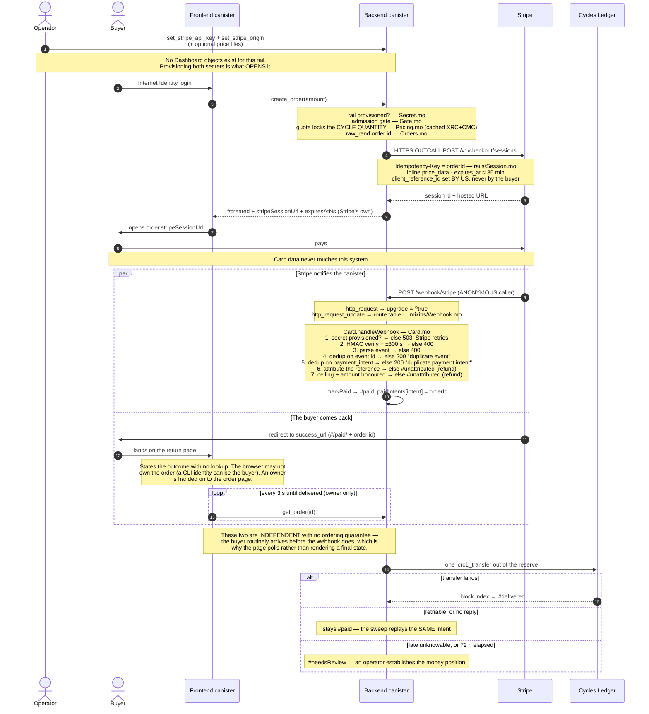

# The Stripe (Card) rail, end to end

How fiat becomes cycles, written from the code: every claim names the module it came
from. The *why* behind each decision, and what the `§N` shorthand in code comments points
at, is `docs/DESIGN.md`.

- [1. The one-sentence version](#1-the-one-sentence-version)
- [2. What the canister calls Stripe for, and what it still cannot do](#2-what-the-canister-calls-stripe-for-and-what-it-still-cannot-do)
- [3. The full happy path](#3-the-full-happy-path)
- [4. Ingress: two paths, and why the webhook can't be caller-authenticated](#4-ingress-two-paths-and-why-the-webhook-cant-be-caller-authenticated)
- [5. Signature verification](#5-signature-verification)
- [6. Attribution: claimed, not trusted](#6-attribution-claimed-not-trusted)
- [7. Dedup: two layers, and what they do not protect against](#7-dedup-two-layers-and-what-they-do-not-protect-against)
- [8. Amount honouring — an equality check](#8-amount-honouring--an-equality-check)
- [8a. What the buyer sees before paying](#8a-what-the-buyer-sees-before-paying)
- [9. Admission: the pre-creation gate](#9-admission-the-pre-creation-gate)
- [10. Order lifecycle — Stripe owns the deadline](#10-order-lifecycle--stripe-owns-the-deadline)
- [11. Refunds, disputes, and what is not automated](#11-refunds-disputes-and-what-is-not-automated)
- [12. Every failure and its money position](#12-every-failure-and-its-money-position)
- [13. The two secrets](#13-the-two-secrets)
- [14. Operator surface](#14-operator-surface)
- [15. Local development against a Stripe sandbox](#15-local-development-against-a-stripe-sandbox)

---

## 1. The one-sentence version

A user picks a preset or types an amount; the canister creates a **Stripe Checkout
Session for that one order** over an HTTPS outcall, setting
`client_reference_id = <principal>_<orderId>` itself; the buyer pays Stripe directly on
that session's URL; and Stripe POSTs a signed `checkout.session.completed` webhook back,
which the canister verifies by HMAC on-chain, attributes to the order, and **transfers**
the cycle quantity locked at order creation out of the gateway's own cycles-ledger
account. Nothing is created on demand: the gateway sells cycles it already holds, so a
delivery either moves them or fails and retries.

## 2. What the canister calls Stripe for, and what it still cannot do

The canister makes exactly three outbound calls, all Checkout Sessions calls: create one
for an order, expire one when the buyer cancels, and retrieve one when the recovery sweep
needs to settle an order whose expiry event never arrived. All over HTTPS outcalls, using
a **restricted** key (`rk_...`) with **Checkout Sessions = Write** (the level that also
grants the read the retrieve needs) and every other permission None.

| Consequence | Detail |
|---|---|
| A leaked key creates sessions that pay **us** | It cannot issue refunds, read customers, touch payouts, or reach the account. That asymmetry is why the scope matters more than the storage (§13). |
| Refunds are manual | The canister structurally cannot issue one. Every refund is a human action in the Stripe Dashboard (§11). |
| No subscriptions or auto-refill | Both require charging a stored payment method. Out of scope. |
| Payment amounts are pinned by **us** | The session carries inline `price_data` with the amount the order quoted, so `amount_total == usdCents` is a property of what the request does *not* enable. The list is in the code beside `Session.createBody`. |

Two things follow from making any outbound call at all:

- ⚠️ **The transform is load-bearing.** Every replica makes the request, so the responses
  must agree byte for byte; Stripe returns a unique `request-id` per request, so
  `Session.strip` discards **all** headers. A per-request value left in place takes the
  rail down with `No consensus could be reached`, and no suite here can catch it, because
  PocketIC mocks outcalls (verified by mutation).
- ⚠️ **`Idempotency-Key = orderId` does two jobs.** Stripe will not create a second
  session for a retried request, and, the load-bearing one, without it each replica would
  create a distinct session, so consensus could never be reached and no transform could
  repair it.

Pricing remains inter-canister: the Exchange Rate Canister for USD/ICP and the CMC for
XDR/ICP. There is no operator-settable rate source to audit.

## 3. The full happy path



Money-out is rail-agnostic from `#paid` onward; the code is keyed by `Types.Rail`,
which is a single-case variant today.

## 4. Ingress: two paths, and why the webhook can't be caller-authenticated

HTTP requests reach a canister through the IC HTTP gateway, which packages them into a
Candid `HttpRequest`. **They arrive as the anonymous principal**: the gateway cannot
propagate Internet Identity, so an HTTP route can only be authenticated by its payload.

| Path | Auth | What uses it |
|---|---|---|
| **Candid calls** | `caller` is the real II principal | The whole app API: `create_order`, `get_order`, `list_orders`, every admin method |
| **One HTTP route** | HMAC over the payload | `POST /webhook/stripe` only |

`Http.mo` dispatches off a route table with a per-route `upgrade` flag
(`mixins/Webhook.mo`). The query half returns `upgrade = ?true` without running the
handler; the gateway re-issues the request to `http_request_update` through consensus.

- `http_request_update` is callable directly via Candid by anyone, so the dispatcher
  re-applies every guard rather than trusting that the query half ran first.
- `Http.pathOf` strips the query string before matching, so a gateway URL carrying
  `?canisterId=…` still routes, which is what makes section 15's local setup work.

Guards on the route, asserted in `test/integration/src/gateway.spec.ts` scenario 05:
unknown path → 404, wrong method → 405 with a lowercase `allow` header, body over 64 KiB
→ 413 (checked before the upgrade decision, so oversized payloads never pay for
consensus).

## 5. Signature verification

`Card.verify` (`Card.mo`) implements Stripe's scheme exactly:

1. **Parse `Stripe-Signature`**: comma-separated `key=value` elements, e.g.
   `t=1492774577,v1=5257a8…,v0=6ffbb5…`. Only the first `t=` counts, unknown schemes
   (`v0=`) are ignored, unparseable elements are skipped. **Multiple `v1=` values are
   collected**: Stripe sends one per active secret during a rotation overlap, and any
   single match verifies, which is what makes rotation zero-downtime with one stored
   secret.
2. **Timestamp window**: `|now − t| > 300 s` → reject. `t` is signed into the payload,
   so it cannot be forged to defeat this. Stripe re-signs on every retry with a fresh
   `t`.
3. **MAC** over `"<t>." ++ raw_body`. The body must be the exact bytes received;
   re-serialised JSON will not verify.
4. **Constant-time compare** (`Hmac.mo`) accumulates XOR across all bytes. A
   short-circuiting compare would be a timing oracle that leaks the expected MAC byte by
   byte.

Header names are matched case-insensitively (`Http.mo`) because proxies re-case them.
Only after verification is the body parsed, and it is parsed as a tree (`Json.mo`),
never scanned for substrings: string values inside authentic Stripe JSON still carry
user-influenced content.

The dispatcher handles six event types (§14). Anything else is acknowledged 200 and
audited, so an extra subscription in the Dashboard does not look like a delivery
failure.

## 6. Attribution: claimed, not trusted

The canister sets `client_reference_id` through the API when it creates the session,
and there is no URL parameter a buyer can touch. The posture is still **claimed, not
trusted**: the field arrives in a webhook body and a webhook body is data, so every
dollar that arrives must resolve to delivery or to a refund obligation, never a silent
accept. It is a pointer, not a credential: the order id is 16 bytes of `raw_rand`, so a
reference cannot be guessed, and forging one gains nothing, because the claimed
principal must equal the order's stored owner.

`handleCheckout` (`Card.mo`) re-derives and checks everything:

| Check | Failure |
|---|---|
| reference present | `#unattributed` — "missing client_reference_id" |
| parses as `<principal>_<orderId>` | `#unattributed` — "malformed" |
| order exists | `#unattributed` — "no order X". Orders are never deleted (§10), so this means the reference never resolved |
| claimed principal **matches the stored owner** | `#unattributed` — "claimed owner does not match" |
| order's rail is `#card` | `#unattributed` — "is not a card order" |
| status is `#created` | `#duplicate` otherwise |
| currency is `usd` | `#unattributed` — "unexpected currency" |
| amount within the ceiling | `#unattributed` — "exceeds the per-purchase ceiling" |

`Orders.parseClientReferenceId` compares principal text rather than calling
`Principal.fromText`, because that traps on garbage and a trapped webhook is a 5xx that
Stripe would retry forever.

Refund obligations are always answered **HTTP 200**: the payment *is* handled, by the
operator's refund queue, and a non-2xx would make Stripe redeliver an event that has
already been routed. The stored `claimedRef` is length-capped at 128 bytes
(`Orphans.maxClaimedRefBytes`) so an attacker cannot stuff arbitrary data into stable
state one webhook at a time.

## 7. Dedup: two layers, and what they do not protect against

In order (`Card.mo`):

1. **`event.id`** catches Stripe redelivering one event. Delivery is at-least-once and
   retries for ~3 days.
2. **`payment_intent`** gives one delivery per payment, even across distinct event
   deliveries that reference the same intent.

Both live in `Idempotency.mo` and are pruned after ~7 days.

⚠️ **Stripe dedup is not double-pay protection.** A user who genuinely pays twice
produces two distinct `event.id`s *and* two distinct `payment_intent`s. The second one
passes both layers, finds the order already past `#created`, and becomes `#duplicate`:
fiat exists, nothing extra was delivered, operator refunds. This is why dedup gates
delivery rather than gating the webhook.

## 8. Amount honouring — an equality check

The order stores a pricing snapshot at creation (`Types.Pricing`): the gross cents, both
rate inputs (`usdPerIcpMicros` from the XRC, `xdrPermyriadPerIcp` from the CMC) with the
XRC quality signal, and the fee formula. `Card.mo` then decides one thing:

- `amount_total` **equals** the order's `usdCents` → deliver `lockedCycles` verbatim.
- Anything else → a refund obligation, nothing delivered, with both figures in the
  detail.
- Above the per-purchase ceiling → the same, checked first.

A per-order session carries the amount we set, so a mismatch means a Stripe feature that
moves the total is enabled. That is an operator problem to see, and repricing it would
deliver against it silently. Two consequences:

- **`lockedCycles` is immutable after creation.** Nothing on the money-in path writes
  it, which is what makes the promise tally exact.
- `#aboveCeiling` stays as defence in depth, and is reachable without tampering: an
  order created under a higher ceiling matches its own quote after the ceiling is
  lowered.

**What was actually paid is stored on the order** (`paidUsdCents`), not only in the
audit log. A fact about money cannot live only in telemetry.

## 8a. What the buyer sees before paying

**The cycle quantity is shown before anything is committed.** `quote_previews(amounts)`
is a public query returning, per amount, the fee, the net, the cycle quantity and the
rate pair it used. ⚠️ It calls the same `quoteCents` that `create_order` calls, not a
reimplemented formula: a client computing its own estimate would be one refactor away
from displaying a number the gateway does not honour. It takes no cap on the input
array, deliberately: work is constant per element the caller already transmitted, so a
cap would only buy silent truncation. It does not disclose the cycles-ledger fee (§3.2);
the frontend asks the ledger directly and shows `cycles − fee`.

**The inverse is answered by the gateway too.** `quote_for_cycles(targets)` returns, per
cycle target, the least gross amount whose quote delivers at least that many cycles, what
it actually buys, and the fee split; it runs the forward quote on the amount it names, so
the figure is the one `create_order` prices. Pass it as `#custom` with `minCycles` set to
the target and the "at least" promise is enforced at creation. An amount outside the
gate's floor or ceiling comes back as that refusal, carrying the bound, so a client can
say "too small" or "too large" without a second call. A client inverting `quote_previews`
by hand is guessing the fee formula and the rounding, and is wrong the moment either
changes.

**The rate is locked at creation, and the lock is enforced.**
`create_order(amount, destination, minCycles)` takes an optional minimum. If the current
rate no longer clears it, the call returns `#quoteChanged {quoted; minimum}` and creates
nothing. ⚠️ **This must be in the update and not the client**: a client-side re-check is
a query and the creation is an update, so the rate can refresh between them. It is a
minimum, not an equality: a move in the buyer's favour passes through, and `null` opts
out. The tolerance is the client's choice; the frontend's policy is 5%, and inside it
the UI states the actual locked figure. Once locked, nothing re-reads a rate.

**One destination: the buyer's own account.** Cycles go to the signed-in principal's own
cycles-ledger account, default subaccount, and `create_order` refuses anything else with
`#destinationNotOwned`. That is a property of the canister, not the frontend. A buyer
funding a canister transfers on afterwards from the CLI.

**The buyer need not be a browser.** Any non-anonymous principal may call
`create_order`, so a CLI identity can buy for itself. The Checkout Session's return URLs
are `#/paid/<id>` and `#/unpaid/<id>` rather than the order page, because the browser
Stripe sends back may not own the order (`docs/DESIGN.md` §10): the return page states
the outcome from the route alone and hands an owner on to the order page.

**The cycles-ledger deposit fee is disclosed, not absorbed.** Delivery loses 100 M
cycles to the ledger's deposit fee on every order; the tiles show what lands. ⚠️
Deliberately not grossed up into the price: covering the fee by sending extra cycles
would let anyone drain the operator by opening orders.

**The order is the record; the audit log is the trail.** Every fact about an order's
money lives on the order: its status, what the buyer paid, why it expired (`expiredBy`),
when its rates were read (`pricing.ratesFetchedAtNs`), its Stripe session and the
deadline Stripe set. `audit_log` answers "what was happening around then", never "what
happened to this order". A refund is the one money fact not on the order: it lives in
Stripe, plus the `#refundAfterDelivery` entry. The app does not model refunds.

| Status | Payable? | Owes cycles? |
|---|---|---|
| `#created` | yes | not yet; the promise is held against the reserve |
| `#cancelled` | **no** — `#cancelled → #paid` is absent from the matrix | no |
| `#expired` | **no** | no |
| `#paid` | already paid | **yes** — one transfer out of the reserve away |
| `#delivered` | — | settled |
| `#needsReview` | — | **yes** — outcome unknown, a human checks the ledger |
| `#abandoned` | — | no; the operator ended it, having refunded by hand |

A payment that arrives for a `#cancelled` or `#expired` order is filed as an
`#unattributed` obligation carrying the payment intent, and the operator refunds it.

**Afterwards: a receipt the buyer can check.** `receipt(orderId)` is owner-scoped (§14)
and returns both rate inputs, so the price recomputes on the buyer's machine from
canisters they query themselves.

## 9. Admission: the pre-creation gate

`create_order` refuses before quoting when fulfilment is already impossible
(`mixins/Buying.mo` → `Gate.mo`), cheapest-first:

| Check | Refusal | Meaning |
|---|---|---|
| amount ≤ `maxPurchaseUsdCents` | `#amountAboveMax` | permanent; the user must change the amount |
| open `#created` orders < `maxOpenOrdersPerPrincipal` | `#tooManyOpenOrders` | the caller must finish or cancel one |
| amount ≥ `minPurchaseUsdCents` | `#amountBelowMin` | permanent |
| `Cycles.balance()` ≥ `minCanisterCycles` | `#canisterCyclesLow` | the canister's own gas is low |
| `reserveFloor − promised ≥ lockedCycles` | `#reserveShort` | the reserve cannot cover this order on top of what it already owes. Carries both figures, so a smaller amount may still succeed |

- **The two "cycles" are different pots.** `minCanisterCycles` is this canister's own
  gas; the reserve is what it sells. Confusing them is the most common local-setup
  mistake.
- ⚠️ **`can_purchase` cannot answer the solvency half.** It is a query, and solvency is
  decided synchronously inside `create_order` against the maintained reserve floor. A
  green `can_purchase` with `availableToSell = 0` is the split working.
- The authoritative check is the one inside `create_order`, in the same synchronous
  block as the hold it takes.

**A refusal writes no audit line.** It increments a counter, readable through the public
`refusal_counts` query, and `RUNBOOK.md` §8 carries a row per counter. Refusals are free
to attempt (`#amountBelowMin` needs no prior state) and the audit log never prunes, so a
line per attempt would be a permanent, free-to-provoke leak. The *operational*
conditions (`#reserveShort`, `#canisterCyclesLow`, and rail closure) are facts about the
gateway, so entering one writes exactly one `gate.startedRefusing` line and
`refusal_counts.refusingNow` stays true until the next successful admission. Rail closure
is refused *before* the gate, so it has its own `railClosed` counter and flag. The latch
is per condition, not global, pinned by `test/gate.test.mo`.

Two of the gate's reasons sit at opposite ends of `admit` for the same reason:
`#unboundedGiveaway` is a fact about the gateway, so nothing about one request may
shadow it; `#buyerNotAllowed` is a fact about one principal, so it must shadow nothing
about the gateway. The anonymous principal is exempt from the buyer allow-list, which
widens nothing (`create_order` rejects `#anonymous` before the gate) and preserves
`can_purchase` as a gateway probe before sign-in.

## 9a. Simulation mode: mainnet against the Stripe sandbox

**One number is the whole switch: `pricing_status().config.divisor`.** `1` is
production; anything greater is simulation. The arithmetic, the four guards, the
faucet-and-ordering rule and what the buyer sees are in `docs/OPERATE.md`, "The
simulation arithmetic", beside the procedure that sets them.

## 10. Order lifecycle — Stripe owns the deadline

**Orders are never deleted, and nothing sweeps them.** There is no TTL. An order's
deadline is its session's `expires_at` (~35 min; Stripe's floor is 30), stored on the
order as `expiresAtNs`, and the only event that moves it to `#expired` is Stripe's
`checkout.session.expired`.

| Status | Payable? | Moved there by |
|---|---|---|
| `#created` | yes, until its own `expiresAtNs` | `create_order` |
| `#expired` | **no** | `checkout.session.expired`, or a failed session creation |
| `#cancelled` | **no** | the buyer, via `cancel_order` |

⚠️ **A missed expiry event leaves the order visibly `#created` past its deadline, and
that is the design.** A sweep as a backstop would flip the order while its reserve
promise stayed held, so a broken order would look like a correctly expired one and the
reserve would leak silently. The stuck order **is** the detection signal.

**Expiry is terminal.** There is no `#expired → #paid` edge, so `Card.handleWebhook`
admits `#created` alone. A late `completed` for a session paid just before its deadline,
or an event resent from the Dashboard years later, is still **attributable** because the
record is still there, and is therefore refunded rather than delivered: an
`#unattributed` obligation carrying the payment intent, which a `charge.refunded`
resolves. The window is narrow: the session and the order die together.

**A buyer can give up on an unpaid order.** `cancel_order(id)` is owner-scoped and
marks a `#created` order `#cancelled`. It is idempotent and refused for a paid order. It
exists because the open-order cap counts unpaid orders and `abandon_order` is
admin-only; without it a buyer who abandoned a checkout would be locked out until the
session expired. ⚠️ **A payment racing a cancellation is refunded, not converted**:
`#cancelled → #paid` is absent from the matrix. `cancel_order` expires the Stripe
session first and marks the order only if that succeeded, so the race stops being
possible rather than merely recorded.

**Growth is bounded at its source.** `Gate.maxOpenOrdersPerPrincipal` (default 1) bounds
the records a user can create for free, and the reserve bounds legitimate volume. An
order is a few hundred bytes, so a million orders is a few hundred MB and millions of
dollars of volume. If store size ever binds, archive to a separate canister.

## 11. Refunds, disputes, and what is not automated

**Refunds are always manual, in the Stripe Dashboard.** What the canister does is react
to `charge.refunded` (`Card.mo`):

1. Resolve every unresolved refund-settleable entry carrying that `payment_intent`.
   This closes the normal loop: duplicate or unattributed payment → operator refunds →
   entry auto-resolves.
2. If nothing resolved, look the intent up in `paidIntents` (written at `markPaid`):
   - **order is `#delivered`** → file `#refundAfterDelivery` and audit
     `stripe.refundAfterDelivery`. Fiat went back and the cycles are irreversibly gone:
     a recorded loss, not a recovery flow.
   - **order is paid but not yet delivered** → audit `stripe.refundBeforeDelivery`.
     Money-out may be mid-flight, so this is a race for the operator to inspect.
   - **intent unknown** → audit `stripe.refundUnmatched`. Benign.

⚠️ **Only a *full* refund settles an obligation.** Stripe fires `charge.refunded` for any
refund, and the event carries a *charge*: `amount` is the charge total and
`amount_refunded` the cumulative amount returned. A refund is complete only when the
second reaches the first (`Card.isFullRefund`). A partial refund leaves the entry open
and audits `stripe.refundPartial`. `#refundAfterDelivery` records `refundedCents` and
`fullRefund`, and deliberately exposes no `paymentRef` to `resolveByPaymentRef`: the
refund is what created the entry, so auto-resolving on it would close the loss the
instant it was recorded.

**An unattributed payment can only be refunded**, including the ones where we know
exactly whose it is. What reaches `#unattributed` is mostly attributable but unpayable:
the per-purchase ceiling was lowered under an existing order, `amount_total` is not the
quoted amount (an account-level setting is moving the total, §8), or the order is
`#cancelled` or `#expired`. The genuinely unattributable cases (no reference, malformed,
naming no order, non-USD) are unreachable through this app, since the canister sets the
reference itself; one means a session created outside it, a reinstalled order store, or
a bug.

**Disputes.** `charge.dispute.created` is parsed and audited as `stripe.disputeCreated`,
audit-only: the canister cannot claw back cycles already delivered. Chargeback risk is
managed with Stripe Radar rules and 3DS on the Stripe side, and the per-purchase ceiling
on ours. The reserve size does not bound chargeback losses; the payments are real.

## 12. Every failure and its money position

`RUNBOOK.md` §6 is the authoritative operator triage table. This is the rail-specific
summary:

| Outcome | HTTP | Money position | Resolution |
|---|---|---|---|
| Secret not provisioned | 503 | nothing happened | provision; Stripe retries |
| Missing/bad signature, stale `t` | 400 | nothing happened | none; not from Stripe |
| Unparseable body | 400 | nothing happened | visible in the Dashboard's delivery log |
| Unhandled event type | 200 | nothing happened | audited `stripe.unhandledType` |
| Verified but unprocessable (e.g. no `payment_intent`) | **200** | unknown; inspect in Stripe | filed `#unprocessable`; see below |
| `checkout.session.async_payment_succeeded` | 200 | **fiat in** | delivers exactly like `completed` |
| `checkout.session.async_payment_failed` | 200 | nothing happened | audited; the order stays payable |
| livemode mismatch | 200 | depends which way | audited `stripe.livemodeMismatch`; a *live* payment on a test-configured gateway is filed as an obligation |
| Redelivered `event.id` / `payment_intent` | 200 | already handled | none |
| `payment_status ≠ paid` | 200 | no money yet | audited `stripe.unpaidSession`; the request asks for card-only, so check the account for a delayed method enabled at that level |
| `#unattributed` | 200 | **fiat in, nothing delivered** | refund in Stripe, the only remedy |
| `#duplicate` | 200 | **fiat in ×2, delivered ×1** | refund the second charge |
| `#deliveryStuck` | 200 | **uncertain**; see the stage | per-stage rules in `RUNBOOK.md` §6 |
| `#refundAfterDelivery` | 200 | **fiat out, cycles out**: a loss | reconcile; consider restricting the payer |

**The buyer is never left waiting indefinitely.** A paid order that cannot progress
alerts the operator at 2 h and escalates at 72 h. ⚠️ **Both bounds are time, and there
is no retry budget**: a replay of a journalled delivery intent is provably safe, so
capping attempts would convert a recoverable state into a manual one. The escalation
names the stage, derived from the delivery journal rather than the order status, because
only the money position determines the recovery. The clocks are per state, not per
order, so total time to resolution can exceed 72 h.

**Why a verified event is never answered with a 4xx.** Once the MAC verifies, the event
came from Stripe. If we then cannot process it, parsing will fail identically on every
retry for Stripe's ~3-day horizon, and Stripe can disable an endpoint that keeps
failing, losing every legitimate webhook after it. So these are acked 200 and filed as
`#unprocessable`. Non-2xx is reserved for input we cannot authenticate (400) and an
unprovisioned secret (503).

**Async payment methods.** Ours asks for `payment_method_types[]=card`, so a delayed
method is unreachable today, but an account-level setting could produce one. The
sequence is `checkout.session.completed` with `payment_status != "paid"`, then
`checkout.session.async_payment_succeeded` when it settles; both run the same handler.

**Test-mode/live-mode confusion.** `set_expected_livemode(?Bool)` declares which Stripe
world this gateway serves. A test-mode signing secret pasted into a canister holding a
funded reserve would otherwise deliver real cycles for payments that never happened.
Unset by default so a sandbox works without configuration; the go-live checklist sets
it to `?true`.

## 13. The two secrets

The webhook **signing secret** (`whsec_…`) and the Stripe **API key** (`rk_…`). Both are
stored plaintext in canister state through the same `Secret.mo` store, by design: HMAC
is symmetric, so verify = forge, and encrypting the stored blob would only move the
problem to a key the canister also needs at verify time. The API key must be sent to
Stripe on every session creation, so the same applies. This is a deliberate departure
from `canister-security` pitfall 9; `docs/DESIGN.md` §7 is the justification.

| Leaked | What it enables |
|---|---|
| Webhook signing secret | forge "paid" events → deliver cycles at operator expense. **Bounded by the reserve balance and nothing else**, detectable against Stripe's event log (forged payments have no matching `payment_intent` there), recovered by rotation. |
| A restricted `rk_` key with Checkout Sessions = Write | create sessions that pay **us**, and read sessions. Annoying, not a loss. |
| An unrestricted `sk_` (**do not use one**) | refunds, payouts, customer data: the whole account. |

What protects them:

| Layer | Status |
|---|---|
| **SEV-SNP confidential subnet** | The deployment target. Confidentiality rests on hardware and attestation, not on cryptography in the canister. |
| **Checkpoint / state-sync confidentiality** | **Confirmed confidential on the target subnet.** Memory encryption alone does not cover state written to disk or synced between nodes. |
| **Provisioning channel** | **Closed.** Both setters take a vetKD ciphertext sealed to this canister (`docs/DESIGN.md` §7.3), so the ingress argument is useless to the boundary node and to a shell history. |
| **Reserve size** | The always-on control, independent of SEV. A forger drains at most what the reserve holds. |

Interface (`mixins/Secrets.mo`):

- `set_webhook_secret(blob)`, `set_stripe_api_key(blob)`: controller-only, traps
  otherwise. The blob is a sealed ciphertext; a plaintext argument is refused
  (`#notCiphertext`). The decrypted secret must be at least 16 bytes, and a working
  secret is left untouched on any rejection. The whole `whsec_…` string, prefix
  included, is the HMAC key.
- `set_stripe_origin(text)`: validated at set time, https, no query, no fragment.
- `webhook_secret_status()` / `stripe_api_key_status()`: `{isSet, generation, setAtNs}`.
  **There is no read-back path, not even for controllers.** `generation` increments per
  successful set, which is how an operator confirms a rotation landed.

`RUNBOOK.md` §2 is the leak procedure: rotate first, reconcile against Stripe's event
log, and refund the reserve only after the secret is dead.

## 14. Operator surface

Card-rail levers, all controller-gated (`Auth.mo`, flat allowlist, equal privileges):

<!-- surface:admin -->

| Method | Purpose |
|---|---|
| `set_stripe_api_key` | provision / rotate the restricted `rk_` key (§13) |
| `set_stripe_origin` | where Stripe returns the buyer; https, no query, no fragment |
| `set_webhook_secret` | provision / rotate the signing secret (§13) |
| `webhook_secret_status` / `stripe_api_key_status` | confirm a rotation landed, without reading either secret back |
| `set_card_tiers` | register the preset amounts. An empty vector shows no tiles and does **not** disable the rail; the switch is both Stripe secrets |
| `set_gate_config` | open-order cap, own-cycles floor, per-purchase ceiling |
| `set_pricing_config` | fee formula, staleness window (capped at 1 h), delta bound, minimum rate sources, and the **simulation divisor**. Three divisor guards: accepted only while `expected_livemode` is exactly `?false`, cannot change while any order is stored, and refused if it would scale the smallest purchase below ten times the cycles-ledger deposit fee |
| `refresh_rates` | force a rate tick now instead of waiting for the timer |
| `set_delivery_config` | the two delivery time bounds: alert-after (2 h) and max hold (72 h). Read them back with `lifecycle_config` |
| `orphans` / `resolve_orphan` | the operator worklist |
| `order_for_payment` | reconciliation: Stripe charge → order it funded |
| `add_admin` / `remove_admin` / `admins` | grant, revoke and list the admin tier. ⚠️ Controller only, and controllers are not listed: they pass the admin guard without being granted |
| `add_allowed_buyer` / `remove_allowed_buyer` / `allowed_buyers` | who may buy while this gateway accepts free Stripe **test** payments. ⚠️ Controller only: the list is the only bound on the *total* given away. **An empty list does not mean "everyone"**: with a funded reserve and test payments accepted it means the gateway refuses every buyer (`unboundedGiveaway`). At `expected_livemode == ?true` the list has no effect |
| `delivery_journal` | money-out record for one order |
| `audit_log` / `audit_log_recent` | operational trail, paginated both ways: `audit_log` walks oldest-first (`afterSeq`), `audit_log_recent` newest-first (`beforeSeq`). ⚠️ `nextCursor` means the opposite in each. Nothing drops, so a gap in `seq` is not a signal |
| `abandon_order` | end a paid or under-review order you have refunded by hand, with the reason recorded |
| `record_delivered` | record that an escalated order's cycles DID reach the buyer, evidenced by the ledger block |
| `pending_deliveries` | every delivery with work outstanding right now, self-clearing |
| `refresh_reserve` | observe the reserve balance now. **Required after a top-up**, or the gateway sells nothing |
| `withdraw_reserve` | return the reserve to the caller. ⚠️ Controller only, and the second destination class for the one outflow. Refused while **any** promise-holder exists. A **decommissioning** lever, not an incident one: during a forged-webhook drain the forged orders are open, so it refuses |
| `recount_orders` | run the tally reconcile now instead of waiting for the daily one. ⚠️ Same bounded pass, same one-directional rule: a recount *below* the maintained tally is refused. No force flag, deliberately |
| `admin_order` / `admin_orders` | read any order, and list with filters + a cursor |
| `admin_receipt` | one order's full receipt for any principal. An **update**, so the read is audited |
| `delayed_deliveries` | orders past the 2 h alert threshold, paginated |
| `resolve_problem` | close one obligation on one order. ⚠️ Takes `(orderId, tag, paymentRef)`, because an order can carry several problems of one kind. `tag` is a variant (`variant { duplicate }`), not text |
| `orphans_unresolved` | the open subset of the orphan list |
| `expire_order` | release a stranded `#created` order's reserve capacity by hand, when the session is still open at Stripe |
| `set_recovery_interval` | sweep cadence; bounded above at a quarter of the ledger's dedup window |
| `set_expected_livemode` | pin test-vs-live so a mismatched webhook is refused rather than honoured |

<!-- /surface -->

⚠️ **There is deliberately no lever that moves money on demand.** No method mints,
transfers on demand or refunds; funding the reserve is `icp cycles transfer` from the
operator's own identity. `record_delivered` records a fact about the ledger, it does not
send. `scripts/check-doc-surface.py` diffs the marked blocks here against the committed
`.did` and the guards in the mixins; it compares names only, so a stale description is
still on a human.

`delivery_stats` is public and anonymous: cumulative delivered orders, cycles and USD,
plus the rail's current refusal state, for a landing page that cannot ask for a login.
⚠️ **Do not add a most-recent-order or largest-purchase field**: each re-identifies
through timing or amount.

Public queries:

<!-- surface:public -->

`can_purchase` · `card_tiers` · `cycles_status` · `delivery_stats` · `expected_livemode` ·
`health` ·
`admin_status` · `lifecycle_config` · `operator_summary` · `orphan_depth` ·
`pricing_status` · `problem_depth` ·
`quote_for_cycles` · `quote_previews` · `recovery_status` · `refusal_counts` ·
`reserve_status` · `stripe_origin`

<!-- /surface -->

Owner-scoped, not admin-scoped:

<!-- surface:owner -->

`get_order` · `list_orders` · `cancel_order` · `receipt` · `process_order`

<!-- /surface -->

They answer only for `caller == order.owner`; not even a controller can read someone
else's receipt. `process_order` also accepts an admin: it is a safe-to-spam delivery
kick. The receipt returns the paid amount, the cycles-ledger block the delivery landed
in, the cycles delivered, and both rate inputs with their XRC quality signal.

### Stripe setup

There are no Dashboard objects to create: no Products, no Prices, no Payment Links.

1. Create a **restricted API key** (`rk_...`) with **Checkout Sessions = Write** and every
   other permission None, and provision it with `set_stripe_api_key`, sealed
   (`docs/OPERATE.md` Mode 2, step 4). ⚠️ **Write, not Read**: Write covers both the
   session the rail creates and the one the recovery sweep retrieves; a key without the
   read leaves stranded capacity unreleasable.
2. `set_stripe_origin`: where Stripe returns the buyer, and the origin the session's
   `success_url`/`cancel_url` are built from.
3. Create a webhook endpoint pointing at `https://<canister-id>.icp.net/webhook/stripe`,
   subscribed to **`checkout.session.completed`**, **`checkout.session.expired`**,
   **`charge.refunded`**, **`charge.dispute.created`** and both
   **`checkout.session.async_payment_succeeded`** / **`_failed`**: six in all, every type
   `Card.handleWebhook` dispatches on. ⚠️ `checkout.session.expired` is not optional: it
   is the only thing that expires an order and releases its reserve promise (§10).
4. Provision the endpoint's signing secret with `set_webhook_secret`, sealed. Provisioning
   the key and this secret is what **opens** the rail, so do it last.
5. Register price tiles with `set_card_tiers`. ⚠️ **Not optional in practice**: with an
   empty list the buy page offers no tiles and no custom field (`docs/OPERATE.md`,
   Mode 3, step 4).
6. **Fund the reserve** with `icp cycles transfer <N>t <backend-id> -n ic`, then
   `refresh_reserve` so the gate has an observation.
7. Optionally tune the delivery bounds with `set_delivery_config`; the defaults (2 h
   alert, 72 h max hold) are the intended production values.
8. Record the account's **Stripe API version** and treat changing it as a code change:
   webhook payload shapes follow the account default.

## 15. Local development against a Stripe sandbox

`scripts/stripe-dev.sh` automates this; `docs/SANDBOX-TESTPLAN.md` is the go-live
verification pass. The precondition that makes it work: `Http.pathOf` strips the query
string, so the local gateway's `?canisterId=…` parameter does not break route matching.

```sh
brew install stripe/stripe-cli/stripe   # once
stripe login                            # once, pick a SANDBOX account

icp network start -d
icp deploy
scripts/local-dev-seed.sh               # gas, reserve, rates, tiers, the API key
scripts/stripe-dev.sh                   # prints the forward URL + wires the secret
```

`stripe listen` prints a signing secret for the forwarding session (`whsec_…`), which is
what goes into `set_webhook_secret`; it is not the Dashboard endpoint's secret. This
exercises the genuine path: real Stripe signatures, real event JSON, real retry
behaviour on non-2xx.

- `stripe trigger checkout.session.completed` builds a synthetic session with no
  `client_reference_id`, so it lands as `#unattributed`, which is itself a useful test.
  For the happy path, create a real order through the app and pay the URL it returns
  with test card `4242 4242 4242 4242`.
- The canister compares the signature timestamp against its own clock. A local replica
  drifted more than 300 s from real time rejects every live webhook with a 400.

For deterministic coverage without Stripe in the loop, the PocketIC suite crafts its own
HMAC-signed payloads (`test/integration/src/harness.ts`). That is the go-live bar, and
it needs no network access or account.
